<!-- 

* Curso: Albañiles digitales.

* Autor: Koldo Sanmartín Bocelo.

* Nombre del proyecto: "Práctica 1".

* Fecha creación: Lunes 17/02/2025.

* Fecha de entrega: Lunes 17/02/2025 16:00 h..

* Descripción: Conectarse a AWS.

-->

# Práctica 1: Conectarse a AWS.

Albañiles Digitales: Cloud (Amazon Web Services)

## Descripción:

En esta práctica, vamos a ver como nos podemos conectar a AWS usando el portal gratuito
de estudiantes.

## Pasos:

### Crearse una cuenta. (hecho en clase).

1. Da el email a tu profesor para que te dé de alta en el curso.

2. Revisa tu email y sigue el formulario para crearte la cuenta.

3. Una vez lo acabes deberías estar en el portal de Canvas.

### Hacer login en la cuenta.

1. Para la próxima vez que quieras hacer login, tienes que acceder a <https://awsacademy.instructure.com> y hacer login ahí como estudiante

### Acceder al laboratorio.

Panel de control:

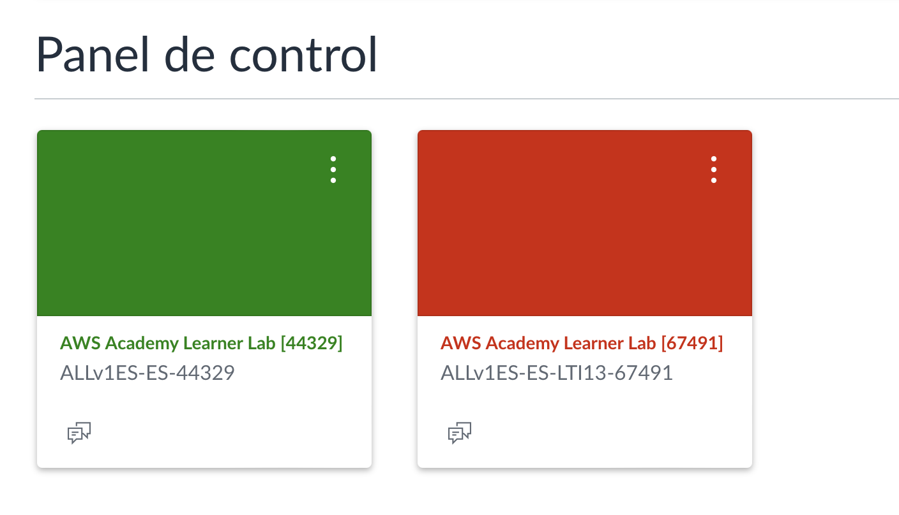

1. Para acceder al laboratorio tenemos que clickar en el panel de control en un curso que se llamará “AWS Academy Learner Lab”:

    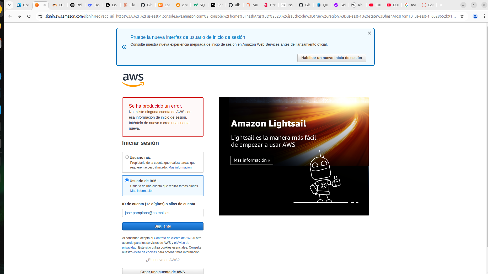

2. Una vez dentro le damos a Contenidos (courses):

    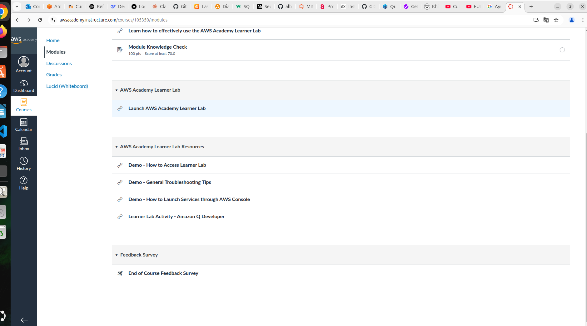

3. Luego a “Lanzamiento del Laboratorio para el alumnado de AWS Academy (Launch AWS Academy Learner Lab):

    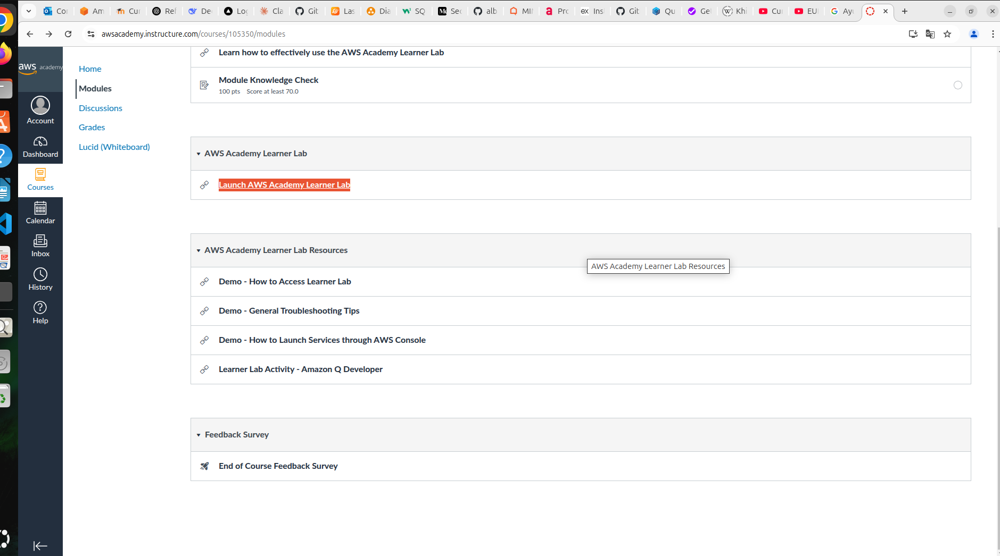

4. Y ahí o bien nos saldrá el laboratorio o tendremos que clickar para que se abra en una nueva ventanaLaboratorio:

    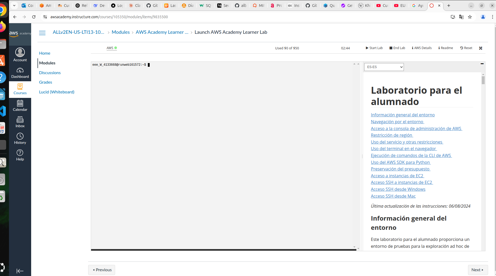

Laboratorio:

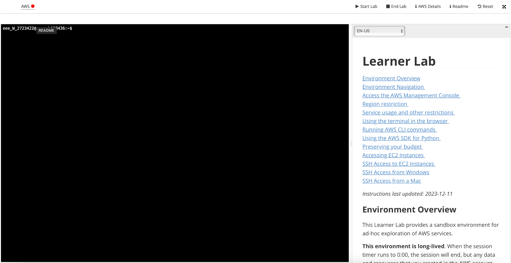

1. El laboratorio es algo así. Desde aqui controlaremos la sesión de aws.

2. A la derecha teneis un manual de instrucciones de como usarlo (arriba de las instrucciones teneis la casilla “EN-US” que podeis clicar para cambiar el idioma y leerlo en castellano):

    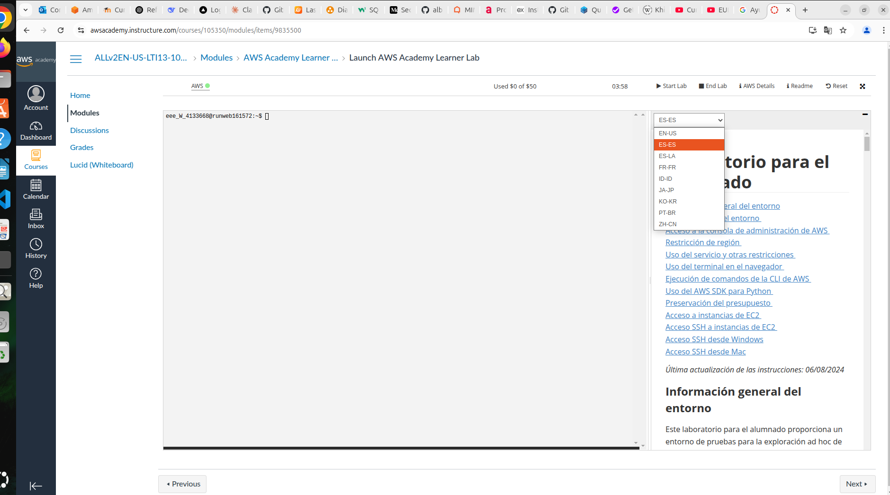

3. Tenéis que saber las siguientes cosas:

    - a. Tenéis un límite de $50 en gasto. Si os pasáis, ya no tenéis más dinero para gastar y tendréis que volver a empezar. Este dinero da de sobra, pero aseguraros de no malgastar:

    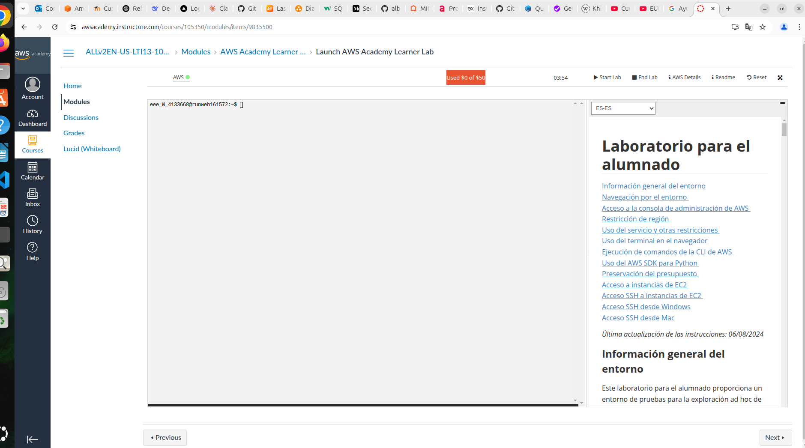

    - b. Todo lo que hagáis se mantendrá en la cuenta una vez “cerreis sesión”. Lo único que las máquinas EC2 se apagarán (si no entiendes esto ahora, ya lo entenderás más adelante):

    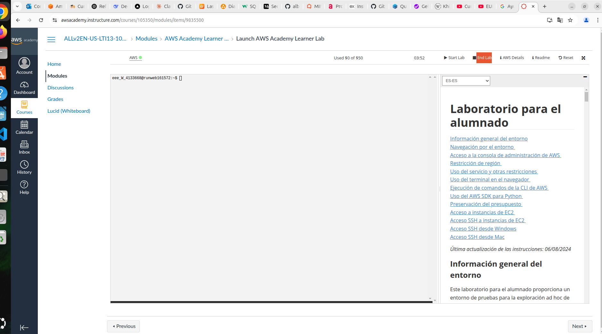

    - c. Solo podeis trabajar en la región us-east-1:

    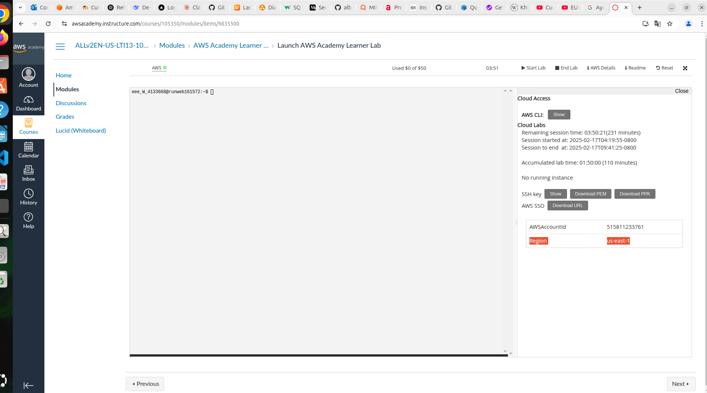

    - d. Tenéis que usar un rol de IAM llamado LabRole para TODO. Si no entendéis del todo que significa esto, quedaros que cada vez que os pida un rol, tenéis que introducir el recurso “LabRole”. Lo iremos viendo en los tutoriales, pero este detalle suele dar muchos dolores de cabeza.

4. Para encender el laboratorio tenéis que clickar en el botón de arriba a la derecha que pone “Start Lab”. Cuando acabéis, tenéis que darle a “End Lab”. Si no clickais, a las 2 horas se cerrará el laboratorio. Insisto, no pasa nada si le dais a End Lab, solo las máquinas se apagan:

    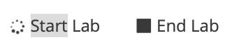

    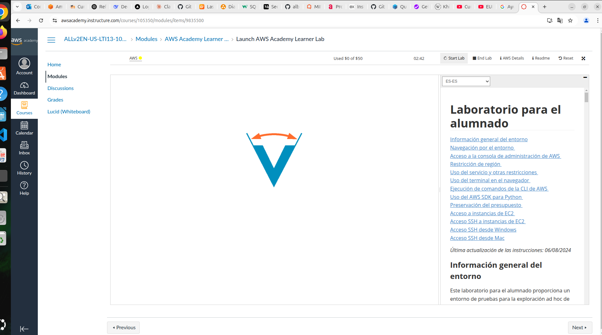

5. Una vez encendido (Se habrá acabado de cargar la V que hay en medio) teneis que clicar en el botón verde que pone AWS, arriba a la izquierda. Si no se os abre nada, es que estais bloqueando las ventanas emergentes:

    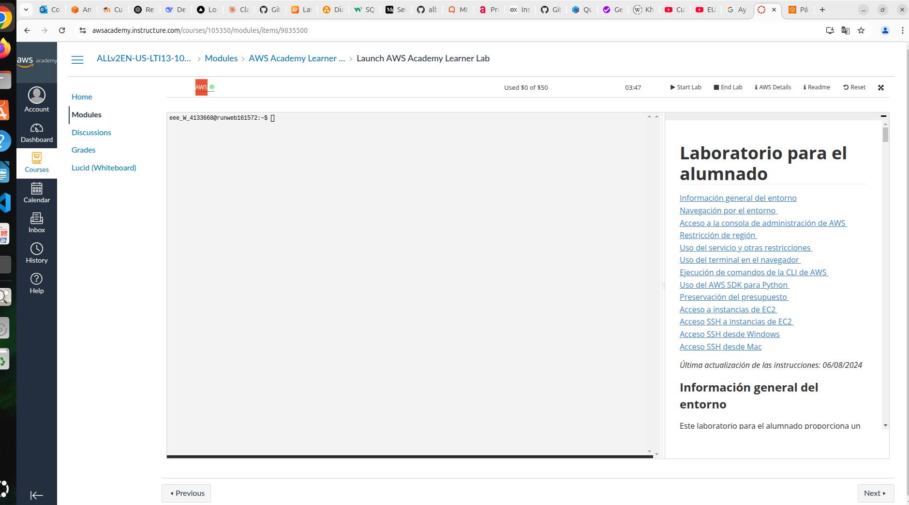

6. Y ahí ya estaréis dentro:

    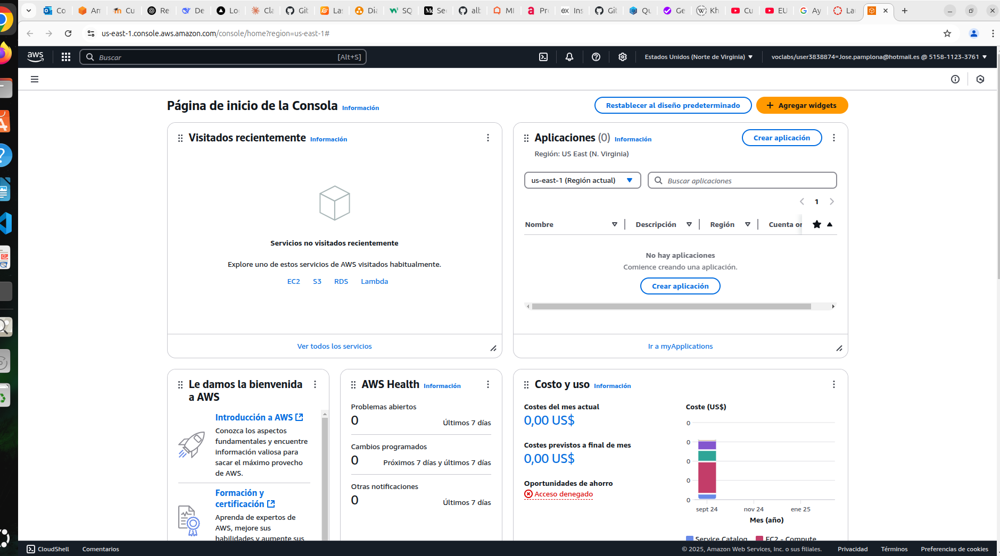
