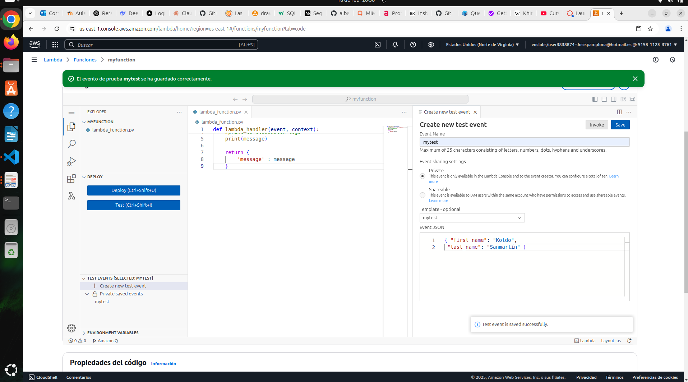

<!-- 

* Curso: Albañiles digitales.

* Autor: Koldo Sanmartín Bocelo.

* Nombre del proyecto: "Práctica 1".

* Fecha creación: Lunes 17/02/2025.

* Fecha de entrega: Lunes 17/02/2025 16:00 h.

* Descripción: Función lambda.

-->

# Práctica 1: Función Lambda.

<span style="color:gray"> Albañiles Digitales: Cloud (Amazon Web Services) </span>

## Descripción:

En esta práctica, vamos a crear una función Lambda que utiliza el lenguaje de programación Python, usando la consola de AWS. También vamos a revisar los logs de Cloudwatch generados por esta función.

## Objetivos:

Completa esta tarea superando los siguientes objetivos:

Crear función Lambda de Python.

- Crea una función Lambda desde cero utilizando la última versión de **Python** como runtime.

- Copia el código de aquí: [example Lambda function code](https://github.com/linuxacademy/content-aws-certified-cloud-practioner/blob/main/labs/create-a-lambda-function-with-the-aws-management-console/lambda_function.py).

Crea un evento de test y ejecuta la función Lambda.

- un evento de test.

- Configura el evento de test usando el siguiente JSON de ejemplo: [example JSON](https://github.com/linuxacademy/content-aws-certified-cloud-practioner/blob/main/labs/create-a-lambda-function-with-the-aws-management-console/test_event.json).

Verifica que CloudWatch ha capturado los logs de la función.

Visualiza en CloudWatch los logs de la función Lambda.

## Pasos

### Crea una Lambda Function en Python

1. Dirígete al servicio Lambda usando la barra de búsqueda superior en la consola.

    

2. Haz click en **Create function**.

    

3. Asegúrate de seleccionar la opción **Author from scratch (crear desde cero)**, y usa la siguiente configuración:

    

    - **Function name**: Escribe myfunction.

    - **Runtime**: Selecciona la última versión de Python.

    

4. Expande la sección **Change default execution rol (cambiar el rol de ejecución predeterminado)**, y verifica que la casilla **Use and existing role (uso de un rol predeterminado)** está seleccionada. En el rol, selecciona **LabRole**.

    

5. Haz click en **Create function**.

    

6. Una vez la función está creada, ve a la pestaña **Code**.

7. Bajo **Code source**, selecciona **lambda_function.py**.

    

8. Reemplaza el código de ejemplo con el siguiente: [example Lambda function code](https://github.com/linuxacademy/content-aws-certified-cloud-practioner/blob/main/labs/create-a-lambda-function-with-the-aws-management-console/lambda_function.py).

    

    

9. Haz click en **Deploy (desplegar, implementar)**.

    

    

### Crea un evento de test y ejecuta la función Lambda

1. Selecciona **Test** > **Create new event**.

    

    

2. Para el campo **Event name**, escribe *mytest*.

    

3. Deja todo igual hasta llegar al campo de Event JSON.

4. En la caja de texto **Event JSON**, reemplaza el código de ejemplo con lo siguiente:

    ```json
        { "first_name": "Your First Name Here", "last_name": "Your Last Name Here" }
    ```

    

5. Actualiza la línea de código JSON para que aparezca tu nombre y apellido.

    ```json
        { "first_name": "Koldo",
        "last_name": "Sanmartín" }
    ```

    

6. Haz click en **Format JSON**.

    

    (no sale esa opción por ninguna parte, o no la encuentro)

7. Haz click en **Save**.

    

8. Haz click en **Test**.

    

9. Revisa los resultados de la ejecución clicando en “**details**”

    

    (no veo ese botón por ninguna parte, o no la encuentro, debe ser la ventana que sale abajo automáticamente)

### Verifica que CloudWatch ha capturado los logs de la función:

1. Haz click en la pestaña **Monitor**.

    

2. Haz click en **View CloudWatch logs (ver registros de CloudWatch )**.

    

    

    
3. Bajo **Log streams (flujos de registros)**, haz click en el log stream más reciente.

    

4. Revisa el log. Deberías ver un output similar al que viste en los resultados de la ejecución.


## Evaluación.

Esta práctica se evaluará en base a los pasos que logréis avanzar Para ello, será necesario enviar un PDF con los pantallazos de las diferentes etapas de esta práctica, mostrando el trabajo realizado:

- Crear función Lambda: pantallazo de la función con el código actualizado.

    

- Crear evento de test y ejecutar la función Lambda: pantallazo del resultado de la ejecución mostrando tu nombre y apellido.

    

- Verificar logs de Cloudwatch: pantallazo de los logs.

    
