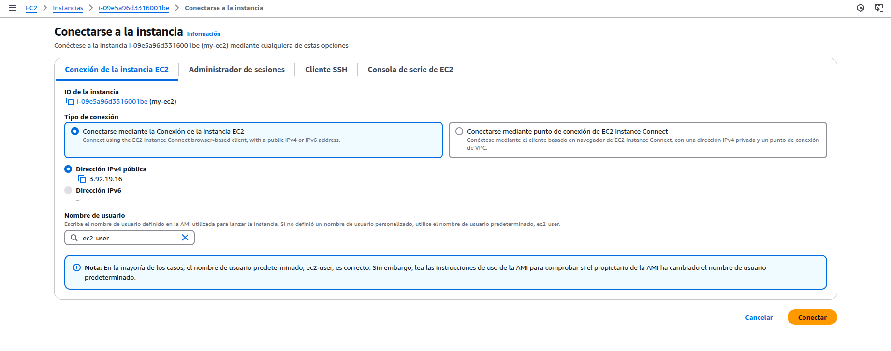

<!-- 

* Curso: Albañiles digitales.

* Autor: Koldo Sanmartín Bocelo.

* Nombre del proyecto: "Práctica 2".

* Fecha creación: Miércoles 19/02/2025.

* Fecha de entrega: Miércoles 19/02/2025 16:00 h.

* Descripción: EC2 en una VPC.

-->

# Práctica 2: EC2 en una VPC.

 Albañiles Digitales: Cloud (Amazon Web Services) 

## Descripción

En esta práctica, vamos a explorar y entender algunas nociones básicas de EC2 (cómputo en la nube), así como los principios más fundamentales de VPC (networking en la nube). Vamos a crear una “virtual private cloud” (VPC), subredes en diferentes zonas de disponibilidad (“Availability Zones” / AZs), rutas, una puerta de salida a internet y más.

## Objetivos

Para finalizar satisfactoriamente esta práctica, hay que completar los siguientes objetivos:

Crear una VPC

- Navega al servicio VPC en la consola de AWS.

- Crea una VPC con los siguientes valores:

  - my-vpc
  - 10.0.0.0/16
  - No IPv6 CIDR block
  - Default tenancy

Crear una subred pública

- Construye una subred privada dentro de la VPC que has creado.

- Asegura asignar bloques CIDR válidos cuando creas tu subnet.

Crear rutas y configura el Internet Gateway

- Habilita la autoasignación de direcciones IPv4 públicas.

- Crea un internet gateway y adjúntalo a la VPC.

- Crea una nueva tabla de rutas para dirigir tráfico en la subnet pública.

Lanzar una instancia EC2 dentro de la subnet

- Launch an EC2 instance in your subnet.

- Select Amazon Linux 2 AMI, 64-bit (x86), t2.micro.

- Select the Vockey key pair

Accede a la instancia EC2

- Conéctate a tu instancia recién creada usando EC2 Instance Connect.

## Pasos

### Create a VPC (Crear una VPC)

1. Navega a **VPC** > **Your VPCs**.

    

    No aparece your VPC, sino que pone crear VPC directamente.

    

2. Haz click en **Create VPC**, y configura los siguientes valores:

    -Select: **VPC Only**

    -Name tag: **my-vpc**

    -IPv4 CIDR block: **10.0.0.0/24**

    

3. Deja los campos IPv6 CIDR block y Tenancy con sus valores por defecto.

    

4. Haz click en **Create VPC**.

    

    

### Create a Public Subnet (Crear una subnet pública)

1. Haz click en **Subnets** en el menú de la izquierda.

    

2. Haz click en **Create subnet**, y configura los siguientes valores:

    

    - VPC ID: **my-vpc**

    - Subnet name: **my-public-subnet**

    - Availability Zone: **us-east-1a**

    - IPv4 VPC CIDR block: **10.0.0.0/24**

    - IPv4 subnet CIDR block: **10.0.0.0/24**

    

3. Haz click en **Create subnet**.

    

### Create Routes and Configure Internet Gateway (Crear tabla de rutas e internet gateway)

1. Con my-public-subnet seleccionado, haz click en **Actions** > **Edit subnet settings**.

    

2. Marca la casilla **Enable auto-assign public IPv4 address**.

3. Haz click en **Save**.

    

    

4. Haz click en **Internet Gateways** en el menú de la izquierda.

    

5. Haz click en **Create internet gateway**.

    

6. Coloca el *Name tag* como "my-internet-gateway".

    

7. Haz click en **Create internet gateway**.

    

8. En la siguiente pantalla, haz click en **Actions** > **Attach to VPC**.

    

9. En el desplegable Available VPCs, selecciona **my-vpc**.

    

10. Haz click en **Attach internet gateway**.

    

11. Haz click en **Route Tables** en el menú de la izquierda.

    

12. Haz click en **Create route table**, y configura los siguientes valores:

    

    - Name: **publicRT**

    - VPC: **my-vpc**

    

13. Haz click en **Create route table**.

    

14. En la siguiente pantalla, haz click en **Actions** > **Edit routes**.

    

15. Haz click en **Add route**, y configura los siguientes valores:

    

    - Destination: **0.0.0.0/0**

    - Target: **Internet Gateway, my-internet-gateway**

    

16. Haz click en **Save changes**.

    

17. Haz click en la pestaña **Subnet associations**.

18. Haz click en **Edit subnet associations**.

19. Selecciona la casilla de **my-public-subnet**.

    

20. Haz click en **Save associations**.

    

### Launch EC2 Instance in Subnet (Lanzar una instancia EC2 en la subnet)

1. Navega a **EC2** > **Instances**.

    

2. Haz click en **Launch instances**.

    

3. Ponle nombre “my-ec2”

4. En la página de AMI, selecciona Amazon Linux 2023 AMI.

    

5. Asegúrate de que t2.micro está seleccionado.

6. En el desplegable de par de claves, selecciona **“vockey”**

    

7. En **Network Settings** modifica la configuración y selecciona la vpc creada anteriormente (my-vpc)

8. La subnet selecciona **“my-public-subnet”** que hemos creado anteriormente

    

9. El resto dejalo tal cual y haz click en **Launch Instance**.

    

10. Haz click en el **id de la instancia (i-0XXXXXXXXX)**, y dale un par de minutos para entrar en estado Running.

    

### Access EC2 Instance (Acceder a la instancia EC2)

1. Cuando la instancia esté en estado *Running*, selecciona la casilla a su lado.

2. Haz click en **Connect** arriba.

3. En la sección *EC2 Instance Connect*, haz click en **Connect**.

    - Esto abrirá una nueva pestaña enseñando una línea de comandos.

    

## Evaluación

Esta práctica se evaluará en base a los pasos que logréis avanzar. Para ello, será necesario enviar un PDF con los pantallazos de las diferentes etapas de esta práctica, mostrando el
trabajo realizado:

- Crear una VPC
- Crear una subnet pública
- Crear tabla de rutas e internet gateway
- Lanzar una instancia EC2 en la subnet
- Acceder a la instancia EC2
