<!-- 

* Curso: Albañiles digitales.

* Autor: Koldo Sanmartín Bocelo.

* Nombre del proyecto: "Práctica 3".

* Fecha creación: Miércoles 19/02/2025.

* Fecha de entrega: Miércoles 19/02/2025 16:00 h.

* Descripción: Docker sobre EC2.

-->

# Práctica 3: Docker sobre EC2.

 Albañiles Digitales: Cloud (Amazon Web Services) 

## Descripción:

En esta práctica, vamos a explorar una de las formas más simples de desplegar un contenedor Docker en la nube: utilizando el daemon de Docker sobre una instancia EC2.

## Objetivos

Descargar y arrancar el servicio Docker en una instancia EC2

- Utilizar `yum` para instalar Docker
- Ejecutar el daemon para poder usar la CLI (línea de comandos) de Docker en la instancia

Descargar una imagen Docker en la instancia

- Explorar la página Docker Hub
- Descargar una imágen pública del Hub a la instancia
- Listar la imagen utilizando la CLI

Levantar un contenedor Docker

- Utilizar la imagen descargada como base para ejecutar varios contenedores Docker en la instancia, y realizar una serie de comandos
- Listar los contenedores Docker

Generar nuestra propia imagen Docker

- Generar una imagen Docker a partir de un contenedor en ejecución
- Utilizar esa imagen para levantar un nuevo contenedor

Limpiar la máquina

- Usando la CLI, parar y eliminar los contenedores Docker de la instancia

## Pasos:

### Descargar y arrancar el servicio Docker

1. Entra a una máquina de EC2. Puedes usar la que creaste en la práctica número 2.

2. Usa el comando: `sudo yum update -y` para actualizar las librerías que se pueden instalar

    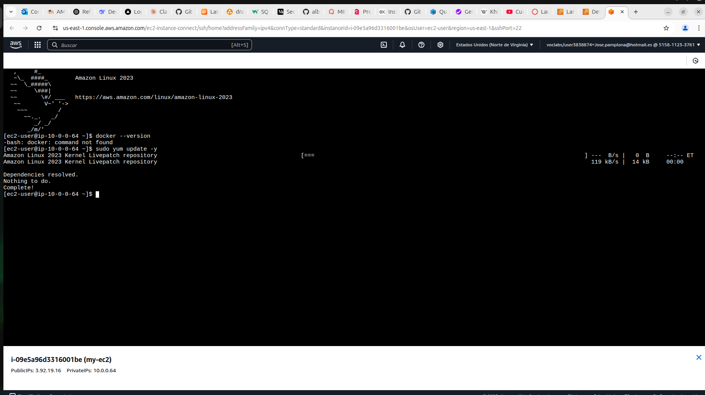

3. Usa el comando: `sudo yum install -y docker` para instalar Docker

    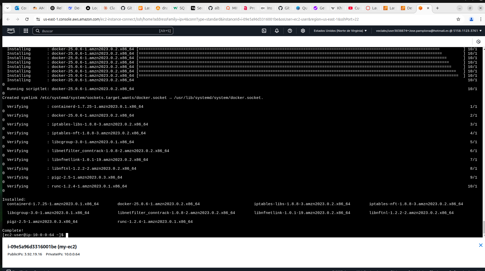

4. Usa el comando: `sudo usermod -a -G docker ec2-user` para añadir tu usuario al grupo Docker

    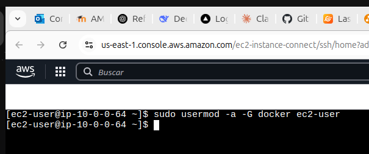

5. Cierra la pestaña de la instancia y vuelve a abrirla, para que se haga login otra vez y adquieras los permisos del grupo docker

    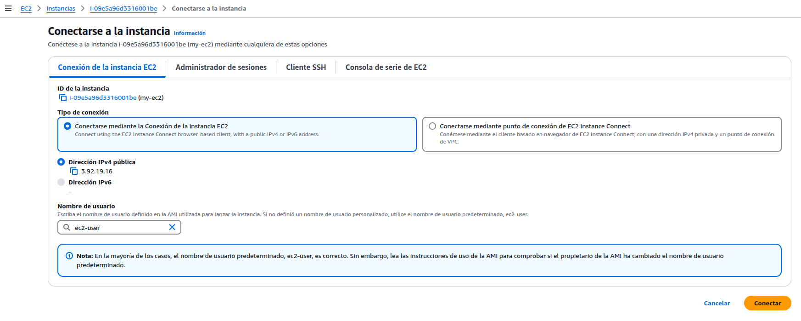

6. Inicia el servicio de Docker con `sudo service docker start`

    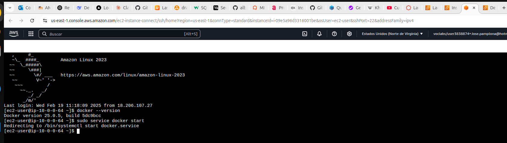

7. Usa el comando: `docker --version` para ver la versión de Docker. Si se muestra una línea con la versión, es que Docker está funcionando correctamente.

    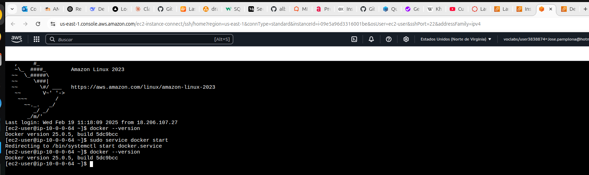

### Descargar una imagen Docker en la instancia

1. Explora Docker Hub: <https://hub.docker.com/search?q=>

    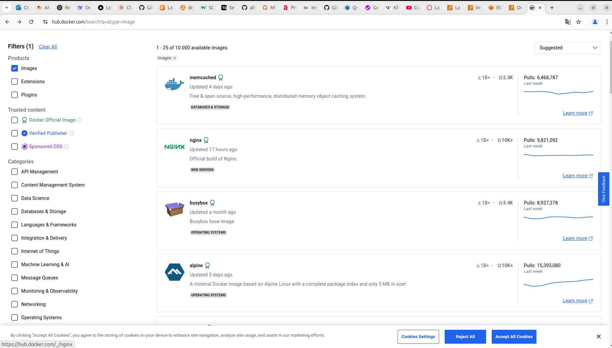

2. Busca la imagen **alpine**

    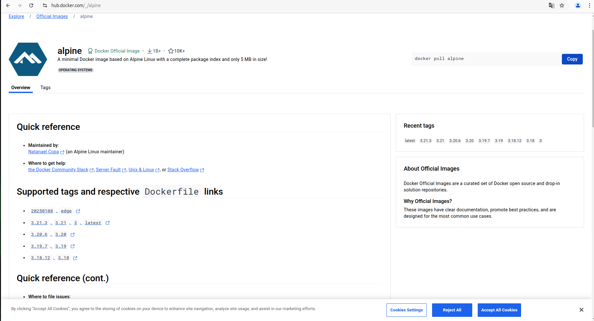

3. Mira su página, la documentación, y copia el comando para hacer pull de la imagen que aparece arriba a la derecha

   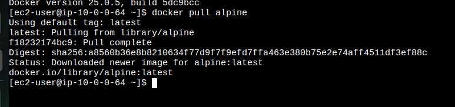

4. Lista las imágenes Docker descargadas en la instancia con el comando: `docker images`. Si en la lista aparece la imagen **alpine**, significa que se ha descargado correctamente.

    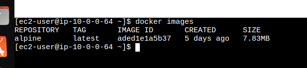

### Levantar un contenedor Docker

1. Utiliza el comando: `docker run -it alpine` para levantar un contenedor de forma interactiva. Se abrirá una sesión con la que puedes lanzar distintos comandos, al igual que una terminal normal.

    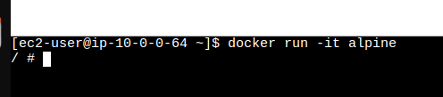

2. Cuando termines de trastear con el contenedor, usa el comando: `exit`

    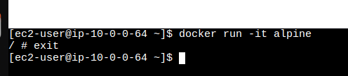

3. Usa el comando: `docker ps -a` para listar los contenedores. Deberías ver un contenedor con el STATUS: Exited (0).

    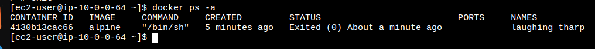

### Generar nuestra propia imagen Docker

1. Utiliza el comando: `docker run -itd alpine` para levantar un contenedor de forma interactiva en segundo plano (gracias al flag -d indicado en el comando).

    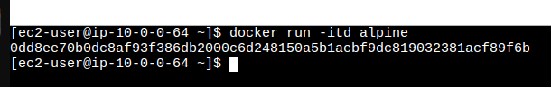

2. Utiliza de nuevo el comando: `docker ps -a` para listar los contenedores. Ahora, además del contenedor con STATUS: Exited (0), deberías ver un contenedor con STATUS: Up. Quédate con el id del contenedor corriendo para usarlo en el siguiente comando.

    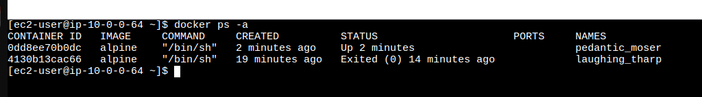

3. Usa el comando: `docker commit {id del contenedor} nueva-imagen` para generar una imagen con el nombre **nueva-imagen** a partir del contenedor que está corriendo.

    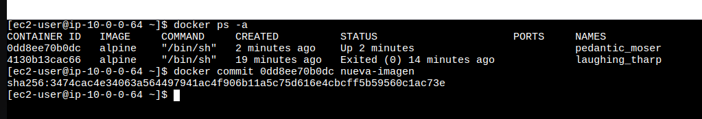

4. Usa el comando: `docker images` para listar las imágenes. Ahora, además de la imagen **alpine**, se debería poder ver en la lista nuestra imagen creada **nueva-imagen**.

    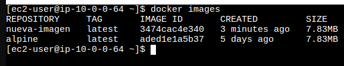

### Limpiar la máquina

1. Utiliza el comando: `docker ps -a` para ver nuestros contenedores.

    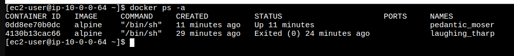

2. Utiliza el comando: `docker stop {id del contenedor corriendo}` para parar el contenedor que está ejecutándose.

    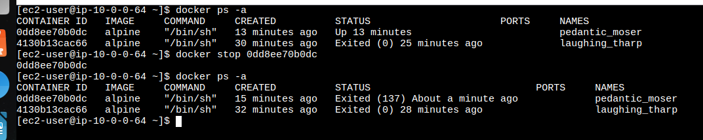

3. Utiliza el comando: `docker rm {id del contenedor}` para ir borrando uno a uno todos los contenedores.

    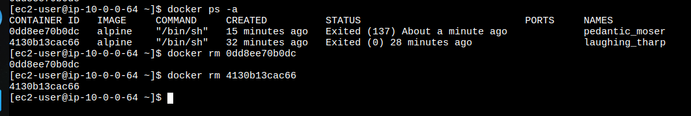

4. Cuando estén todos los contenedores borrados, usa de nuevo el comando: `docker ps -a` para demostrar que no quedan contenedores en la instancia.

    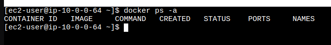

## Evaluación

Esta práctica se evaluará en base a los pasos que logréis avanzar. Para ello, será necesario enviar un PDF con los pantallazos de las diferentes etapas de esta práctica, mostrando el trabajo realizado:

- Descargar Docker: pantallazo del resultado del comando `docker --version`
- Descargar imagen Docker: pantallazo del resultado del comando `docker images`
- Levantar un contenedor Docker: pantallazo del resultado del comando `docker ps -a`
- Generar nuestra propia imagen Docker: pantallazo del resultado del comando `docker images` tras la generación de la nueva imagen
- Limpiar la máquina: pantallazo del resultado del comando `docker ps -a`

Todas estas capturas de pantalla están a lo largo de la práctica.

Fin de práctica.
