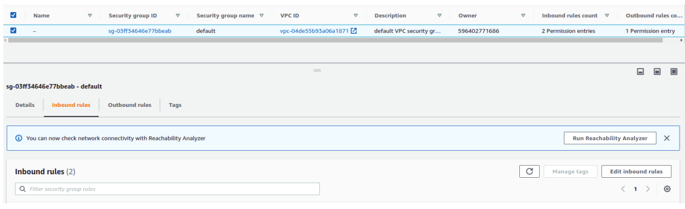
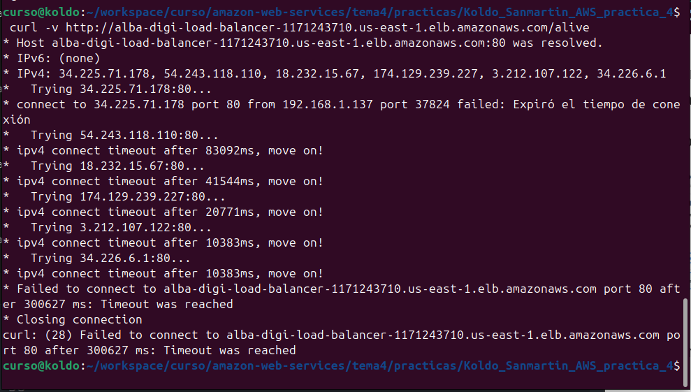

# correo:

Hola, muy buenas:

Envío este PDF en relación de la práctica 4 para entregar este martes.

Lo que ocurre es que estoy en el último paso y me falla la aplicación, pues no consigo poner el Inbound rules como especificáis:

## 5. Probar el servicio

Para poder dar por buena la práctica tenéis que añadir los **siguientes 3 pantallazos** (los más importantes!)

1. Un pantallazo del servicio con sus 2 tasks en running, tal que así.

    

    en el caso de la práctica mia, sería:

    

2. Un **pantallazo de los eventos del servicio**, donde se vea que el servicio está steady (puede que tarde un poco en aparecer)

    

    en el caso de la práctica mia, sería:

    

3. Una prueba de que el servicio está ejecutándose. Para ello vamos a hacer lo siguiente:
    a. Ir al servicio EC2
    b. Ir al apartado “Load Balancers”
    c. Copiar el dns name, lo podeis encontrar aquí
        
        en el caso de la práctica mia, sería:
        
    d. Abrir una terminal y escribir “curl -v http://{SUSTITUYE}/alive” donde lapalabra SUSTITUYE es el DNS Name de arriba. Sería algo así
    
    en el caso de la práctica mia, sería:
    
    quedando:
    
    e. Como veis falla. Es porque al crear una VPC tenéis que abrir esa red a vuestro internet. Para ello vais al servicio EC2, Security groups, seleccionamos el que pone “default” y le dais a Inbound rules, edit Inbound rules
     
     en mi caso:
     

    f. Le dais a add rule y lo dejáis así
    
    g. Le dais a save rule y volveis a probar a hacer la petición en la terminal. Os debería salir lo siguiente
    

Lo que me falla es que en el apartado e. a mi me salen 2 default y  lo intento con cualquiera de los 2 y no consigo que la aplicación funcione:

Cuando cambio el primer Security groups default, sale:

al hacer el curl:

Cuando cambio el segundo Security groups default, sale:

Y no consigo salir de esto por mucho que intento, no entiendo porqué me sale distinto que a vosotros, saliendo 2 Security groups default y no uno
