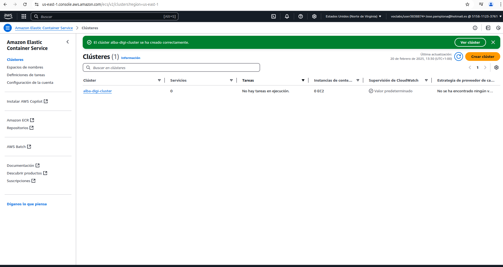
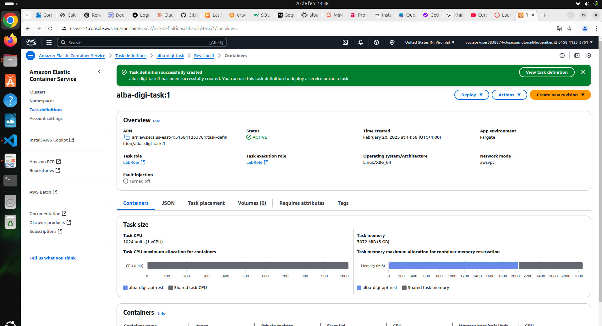
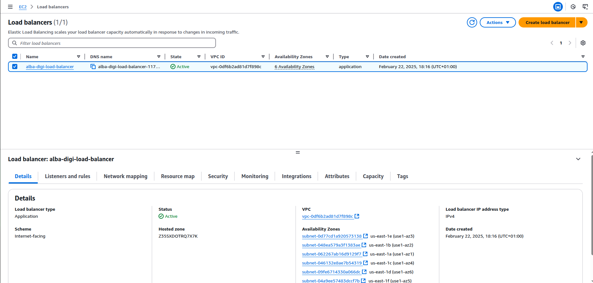
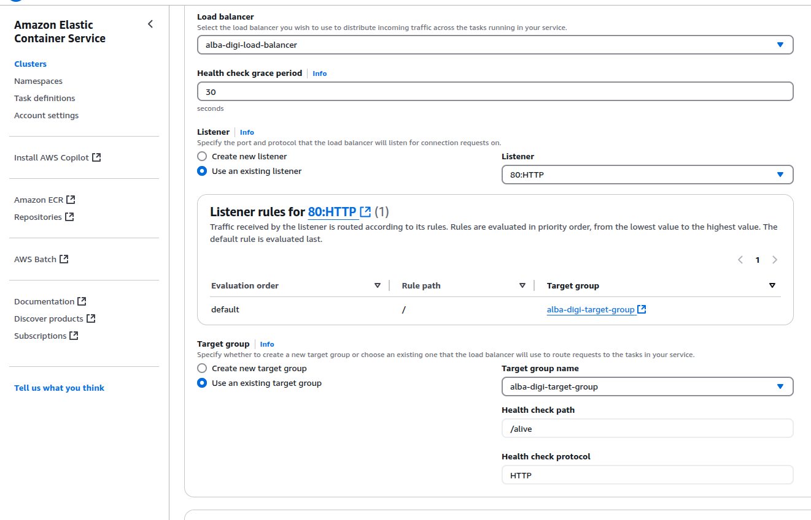
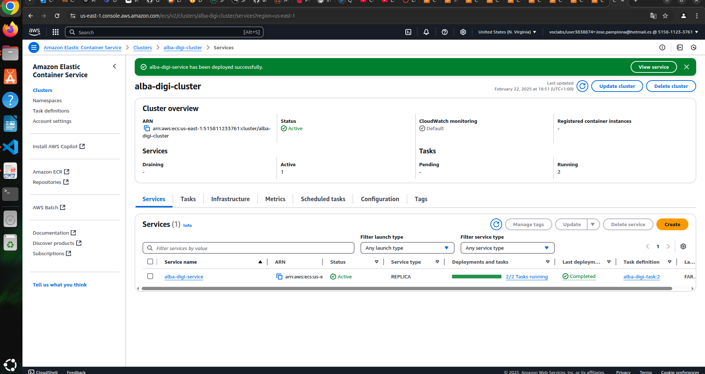
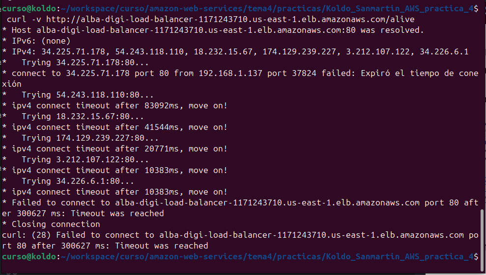

# Que entregar

Recordemos que para terminar esta entrega hay que entregar:

1. Foto de la creación del cluster

2. Foto de la creación de la task definition

3. Foto de la creación del balanceador de carga

4. Foto de la creación del servicio

5. Foto de la terminal donde se ver que el servicio funciona
