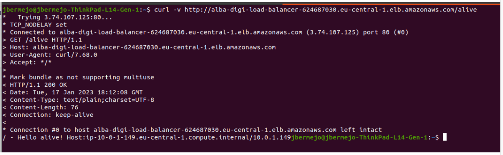

<!-- 

* Curso: Albañiles digitales.

* Autor: Koldo Sanmartín Bocelo.

* Nombre del proyecto: "Práctica 4".

* Fecha creación: Miércoles 19/02/2025.

* Fecha de entrega: Miércoles 19/02/2025 16:00 h.

* Descripción: Orquestación de Contenedores.

-->

# Práctica 4: Orquestación de Contenedores.

 Albañiles Digitales: Cloud (Amazon Web Services) 

## Introducción

Como ya hemos visto en la teoría, hay muchas razones por las que orquestar los contenedores y crear un servicio. En esta práctica vais a desplegar un servicio desde la consola de AWS. La entrega final serán unas capturas del proceso, así que id guardando capturas de pantalla de como vais haciendo el proceso. El guión de la práctica indicará cuándo hacer las fotos.

Recordemos los pasos que hay que hacer:

1. Crear un Cluster para el servicio
2. Crear un tipo de tarea para el servicio
3. Crear un balanceador de carga (para saber a qué máquina apuntar)
4. Crear el servicio

Ahora vamos a ir paso por paso viendo cómo podemos hacerlo. En este caso **NO queremos ocuparnos de las instancias EC2**. Veremos cómo funcionan las instancias Fargate, para quitarnos un dolor de cabeza de encima.

## 1. Crear un Cluster

Recordemos que un cluster es un conjunto de instancias/máquinas que trabajan conjuntamente con un objetivo. Vamos a empezar creando ese grupo.

1. Entramos en “Elastic Container Service”
2. Veremos un botón que dice “Create Cluster”. Clicamos en el
3. Como vamos a usar instancias AWS Fargate, clicamos en “Networking only”
4. Lo configuraremos de tal manera:
    a. Le ponemos un nombre. Por ejemplo “alba-digi-cluster”
    b. En infrastructure, selecciona 'AWS Fargate (serverless)'
    c. En tags ponemos. Key: “Name” Value: “alba-digi-cluster”
    d. **NO** clicamos en Enable Container Insights.
    e. Le damos a create
5. Ahora el cluster se estará creando. Puede que tarde un rato, así que esperamos un poco
6. Una vez se cree, hacemos una **captura y la guardamos para la entrega**
7. Clicamos en “view cluster”

Ya tenemos el cluster creado. Ahora vamos a por el siguiente paso

## 2. Crear un tipo de tarea para el servicio (task definition)

Ahora le tenemos que explicar al cluster que tarea va a ejecutar. Para eso la tenemos que
definir. Recordemos que (por simplificar) tarea=contenedor. Vamos a definir esta tarea.

1. Viendo el cluster que acabáis de crear, a la izquierda tendréis una columna con diferentes opciones. Clicad en “task definition”
2. Le dais a “Create new Task Definition”. Así definiremos la tarea
3. Clicais en “Fargate”. Hacemos esto porque queremos usar este tipo de instancias en lugar de las de EC2
4. Lo configuramos de la siguiente manera
    a. Task definition name: “alba-digi-task” -> Nombre de la tarea
    b. Task role: LabRole
    c. Network mode: awsvpc (la de por defecto) -> La red donde se conecta
    d. Operating system family: linux -> Si queremos linux o windows
    e. Task execution Role: LabRole -> El único rol que podemos poner con estas cuentas
    f. Task CPU: 1 cpu -> Cuanto cómputo le vamos a dar a esta tarea
    g. Task memory: 3GB -> Cuanta memoria máxima va a tener esta tarea

Ahora llegaremos a una parte donde hay un botón que dice “Add container”. Si clicamos en él veremos que se abre una nueva ventana y que nos pide el nombre del contenedor, su url, etc. Aquí Amazon nos está pidiendo que le indiquemos qué contenedor va a ejecutar.

Para ello tenemos que subir nuestro contenedor a su repositorio de contenedores. Este servicio se llama ECR (Elastic Container Registry). Explicaros como hacer esto puede ser un poco liante y se nos va del objetivo de esta práctica, así que por ahora ignoraremos este proceso. Os vamos a dar directamente la URL del contenedor y toda esta información.

Por lo tanto clicamos en “Add Container” y añadimos lo siguiente:

- Container name: alba-digi-api-rest -> Nombre del contenedor
- Image: public.ecr.aws/n0h7v2z5/alba-digi-api-rest:latest -> URL del repositorio donde está el contenedor
- Memory Limits(Mib): (Soft Limit) 2 -> Cuanta memoria le vamos a dar al contenedor. Le vamos a dar la mayoría de la memoria que pusimos más arriba (antes hemos marcado 3GB)
- Port Mappings: 5050 - Protocol: TCP - App protocol: HTTP -> Significa que abrimos el puerto 5050, que es el que pide este contenedor según [su documentación](https://hub.docker.com/r/vad1mo/hello-world-rest)
- Environment:
  - CPU Units: 1 (la que le hemos asignado a la tarea más arriba)
- El resto lo dejamos tal cual y le damos al botón que está abajo del todo que pone “Add”
- Y bajamos al final y le damos al botón que pone “Create”. Sacamos una **foto para la entrega** y vamos a “View Task Definition”

Así tendremos la task definition creada. Ahora podemos pasar al siguiente paso, crear el balanceador de carga

## 3. Crear un balanceador de carga

Ya tenemos un cluster (conjunto de máquinas) y una task definition (la tarea que va a hacer ese cluster). Pero ahora necesitamos alguien que nos indique a qué máquina del cluster va a llegar nuestra petición. Por eso necesitamos un balanceador de carga. Para ello vamos a hacer lo siguiente:

1. Vamos al servicio “EC2”
2. En la columna izquierda buscamos “Load Balancers” y clicamos en él. Estará en la subsección “Load Balancing”
3. Clicamos en “Create Load Balancer” y luego en “Application Load Balancer”
4. Rellenamos la configuración así:
    a. Load Balancer Name: alba-digi-load-balancer
    b. Scheme: Internet-facing -> Queremos que se pueda acceder desde internet
    c. IP address type: IPv4
    d. En Network Mapping seleccionamos todas las zonas que haya y dejamos la subnet por defecto -> Queremos que pueda acceder a las redes por defecto de todas las zonas
    e. Security groups dejamos el de por defecto -> Tema de seguridad sería otro capítulo.
5. Y ahora veremos la sección de Listeners and Routing.

Ahora le vamos a explicar al balanceador a qué grupo de máquinas puede redirigir. Y para ello tenemos que crear ese grupo de máquinas. Será un grupo inteligente, así todo será automático. Será un “Target group”, así que vamos a clicar donde pone “Create target group”

Esto nos llevará a otra pantalla donde configuraremos el target group. Para ello rellenaremos la web con esta configuración:

1. Choose a target type: IP addresses (Las instancias de tipo Fargate son targets de tipo IP por alguna razón, así que dejamos la configuración así)
2. Target Group Name: alba-digi-target-group
3. Protocol: HTTP
4. Port: 5050 -> Más arriba hemos abierto el puerto 5050, que es donde funciona este contenedor. Cuando el balanceador apunte a este grupo de instancias, queremos que apunte en el puerto 5050.
5. VPC: Seleccionamos la que hemos creado anteriormente junto al cluster (que debería ser la única)
6. Protocol Version: HTTP1
7. Ahora sí que vamos a configurar el healthcheck
    a. Health Check Protocol: HTTP
    b. Health Check Path: /alive
8. Clicamos en Next. lo dejamos todo igual y luego en Create Target Group

Con esto ya tenemos nuestro target group. Ahora podemos seguir configurando nuestro balanceador de carga. Volvemos a la pestaña anterior, clicamos en el círculo más a la izquierda y en el desplegable seleccionamos el target group que acabamos de crear. Lo dejamos tal que así.

Y le damos a Create Load Balancer. Le damos a “view Load Balancer” y hacemos una **captura de pantalla para el entregable**. Ahora tenemos que esperar un poco hasta que en “State” cambie de “provisioning” a “Active”.

Ya tenemos nuestro balanceador de carga, por lo que podemos empezar con nuestro último paso.

## 4. Crear el servicio

Ahora tenemos un cluster (conjunto de máquinas), una task definition (una tarea tipo) y un balanceador de carga (quien sabe a donde apuntar). Ahora necesitamos juntar todo esto, y para ello vamos a crear un servicio. Para ello haremos lo siguiente:

1. Volveremos al cluster que hemos creado anteriormente. Para ello vamos al servicio “Elastic Container Service” y clicamos en él: alba-digi-cluster
2. Abajo veremos que está seleccionada la pestaña “Services”. Clicaremos en el botón de abajo, donde pone “Create”. Así empezaremos a crear el servicio
3. Lo configuraremos tal que así:
    a. Compute options: Launch type
    b. Launch Type: Fargate (Habíamos decidido no usar ec2, y usar fargate)
    c. Platform version: latest
    d. Application type: Service
    e. Task definition - Family: alba-digi-task (la creada anteriormente)
    f. Task Definition - Revision: La que ponga (latest)
    g. Service Name: alba-digi-service
    h. Number of tasks: 2 (vamos a poner más de una, que ya que creamos el servicio…)
    i. Deployment options: rolling update, min 100%, max 200%
    j. Deployment failure protection: desmarcamos la casilla de circuit breaker, ya que no queremos que actúe.
4. En la misma página, en el apartado ‘Load Balancing’:
    a. Load Balancer Type: Application Load Balancer
    b. Use existing load balancer
    c. Seleccionamos el que hemos creado en el paso anterior
    d. Donde pone Health Check grace period ponemos 30 (le vamos a dar 30 segundos antes de empezar a verificar si el servicio está sano)
    e. Load balancer name: alba-digi-load-balancer
    f. En Container to load balance: Seleccionamos alba-digi-api-rest:5050:5050
    g. Use an existing listener -> 80:HTTP
    h. Use an existing target group: alba-digi-target-group – /alive – HTTP
5. **Hacemos un pantallazo a toda la pantalla** (que se vean todos los campos) y lo añadimos a nuestra entrega. Luego le damos a “Create”.
6. Volvemos a la pantalla del clúster, y hacemos un pantallazo que se vea el servicio. Después, clicamos en nuestro servicio para ver cómo está en su interior.

¡Ya tenemos nuestro servicio funcionando! Vamos a probarlo y podemos dar la práctica por terminada.

## 5. Probar el servicio

Para poder dar por buena la práctica tenéis que añadir los **siguientes 3 pantallazos** (los más importantes!)

1. Un pantallazo del servicio con sus 2 tasks en running, tal que así.

    

2. Un **pantallazo de los eventos del servicio**, donde se vea que el servicio está steady (puede que tarde un poco en aparecer)

    

3. Una prueba de que el servicio está ejecutándose. Para ello vamos a hacer lo siguiente:
    a. Ir al servicio EC2
    b. Ir al apartado “Load Balancers”
    c. Copiar el dns name, lo podeis encontrar aquí
        
    d. Abrir una terminal y escribir “curl -v http://{SUSTITUYE}/alive” donde lapalabra SUSTITUYE es el DNS Name de arriba. Sería algo así
    
    e. Como veis falla. Es porque al crear una VPC tenéis que abrir esa red a seleccionamos el que pone “default” y le dais a Inbound rules, edit Inbound rules
    
    f. Le dais a add rule y lo dejáis así
    
    g. Le dais a save rule y volveis a probar a hacer la petición en la terminal. Os debería salir lo siguiente
    

## Que entregar

Recordemos que para terminar esta entrega hay que entregar:

1. Foto de la creación del cluster
2. Foto de la creación de la task definition
3. Foto de la creación del balanceador de carga
4. Foto de la creación del servicio
5. Foto de la terminal donde se ver que el servicio funciona

## Conclusiones

En esta práctica hemos levantado un servicio con múltiples máquinas. Hemos dejado de lado muchísimos temas de seguridad y buenas prácticas porque no nos daba tiempo. Os animamos a que investigueis estos temas, ya que son imprescindibles si queremos implantar estas tecnologías en una empresa.Recordad borrar todo y si tenéis alguna duda preguntadnos sin miedo!
