<!-- 
* Curso: Albañiles digitales.
* Nombre del proyecto: "Manual Markdown".
* Autor: Koldo Sanmartín.
* Fecha creación: Martes 17/12/2024. 
-->

# Ejercicio clase 2:

## Descripción:

Ejercicio:

Basándonos en el modelo de entidad-relación definido en la Clase 1, realizar las
siguientes acciones:

1. Creación de las tablas que sean necesarias.

2. Insertar algunos registros en cada una de ellas.

3. Realizar las siguientes consultas sql:

- Obtener el lista de los proveedores que tiene la tienda.

- Consultar si existe algún cliente que se llame Mario.

- Obtener el listado de los productos de la tienda ordenados por precio.

Para realizar el ejercicio se puede utilizar PGAdmin o directamente los comandos en consola, pero para poder corregirlo necesito un documento en el que me paséis las consultas sql utilizadas en cada caso (tanto para la creación de las tablas, la inserción de
los datos, como de las consultas).

## Resolución:

Basándonos en la resolución del ejercicio:

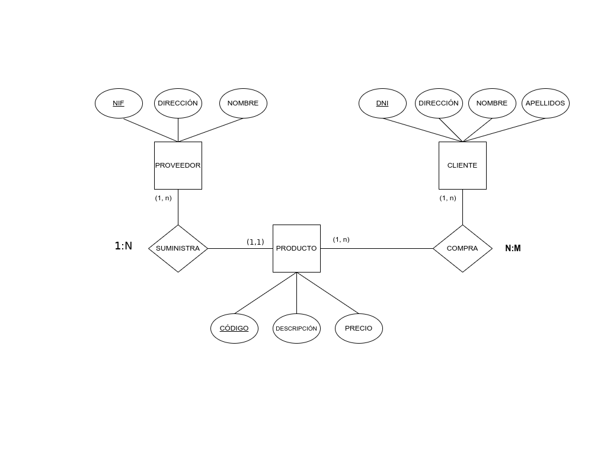

Creemos la base de datos tecleando:

```bash
create database ejercicio2;
```

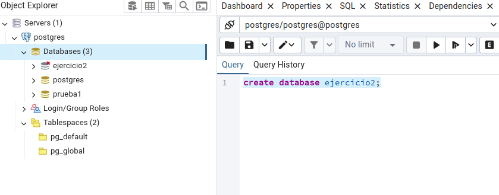

Abrimos query tool pinchado encima de la base de datos ejercicio2 para trabajar en ella:

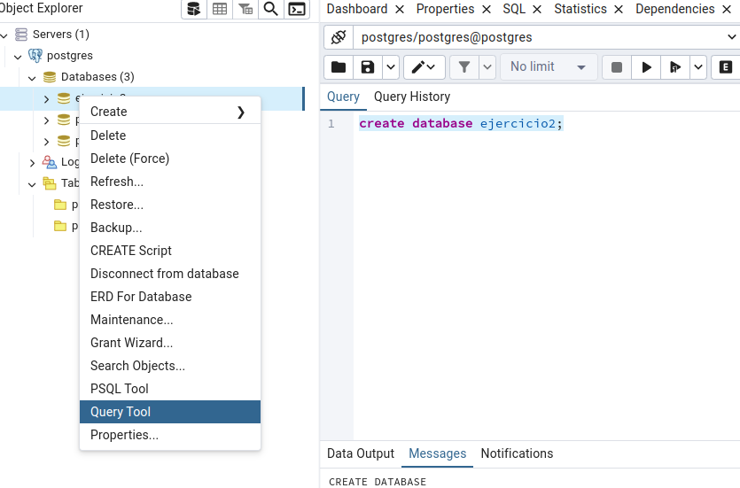

### 1. Creamos las tres tablas necesarias:

1. **Proveedor** con las columnas NIF (varchar, primary key), dirección (varchar) y nombre (varchar), tecleando:

   ```bash
   create table Proveedor (NIF varchar primary key, direccion varchar, nombre varchar);
   ```

   Refrescamos y vamos viendo como queda:

   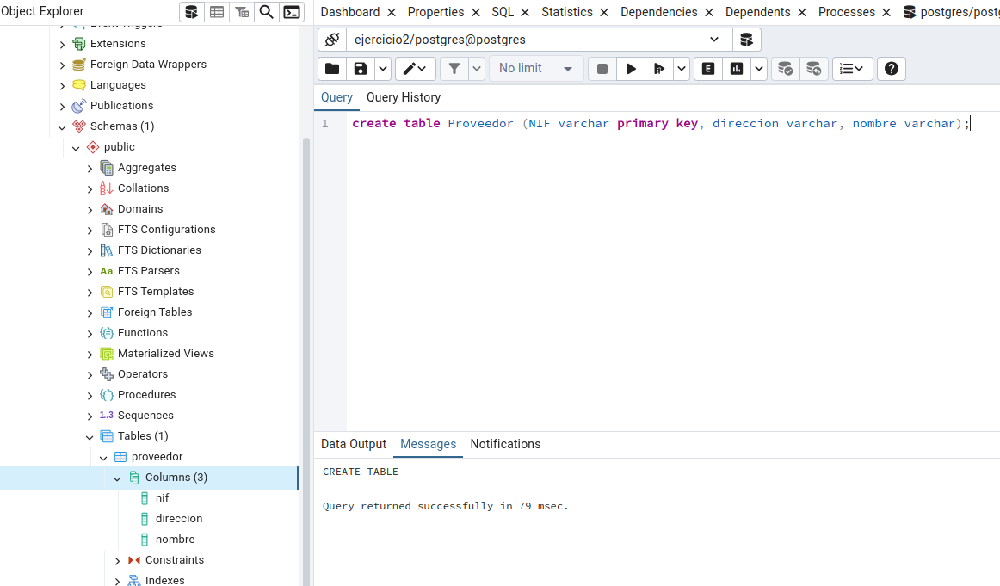

2. **Cliente** con las columnas DNI (varchar, primary key), dirección (varchar), nombre (varchar) y apellidos (varchar), así:

   ```bash
   create table cliente (DNI varchar primary key, direccion varchar, nombre varchar, apellidos varchar);
   ```

   Refrescamos y vamos viendo como queda:

   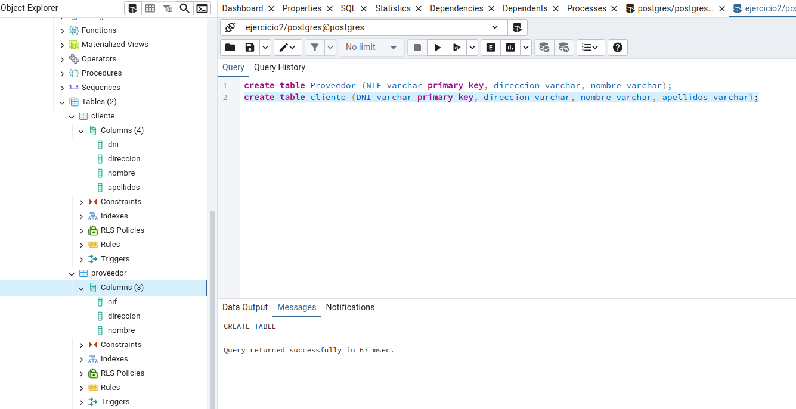

3. **Producto** con las columnas código (serial, primary key, éste autoincrementable), description (varchar), precio (float).

   ```bash
   create table producto (codigo serial primary key, description varchar, precio float);
   ```

   Refrescamos y vemos como queda:

   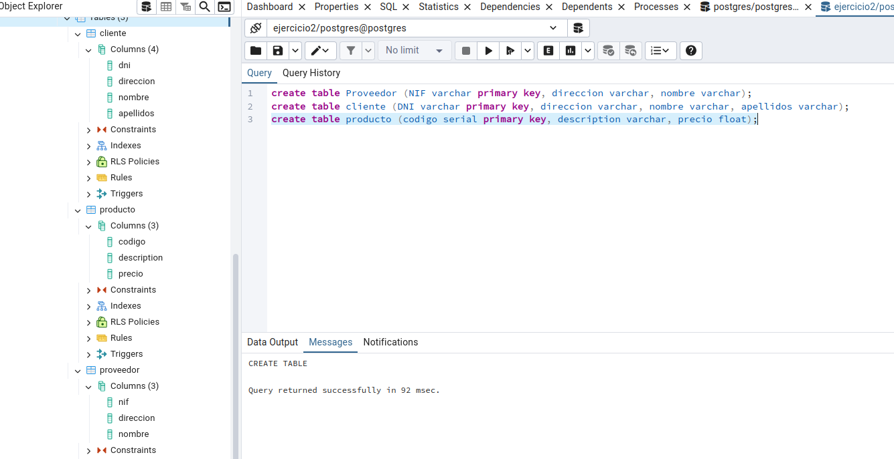

### 2. Insertar algunos registros en cada una de ellas:

1. **Proveedor**, tecleando lo siguiente:

   ```bash
   insert into proveedor (NIF, direccion, nombre)
   values
   ('32456346Y', 'Madrid', 'Miguel'),
   ('87643796E', 'Barcelona', 'Manuel'),
   ('90874678R', 'Bilbao', 'Mario'),
   ('34243677H', 'Sevilla', 'Mario'),
   ('56453564J', 'Zaragoza', 'Lucía');
   ```

   Y los 5 registros los ingrasamos en un sólo comando, luego comprobamos que se han ingresado correctamente:

   ```bash
   select * from proveedor;
   ```

   Quedando así:

   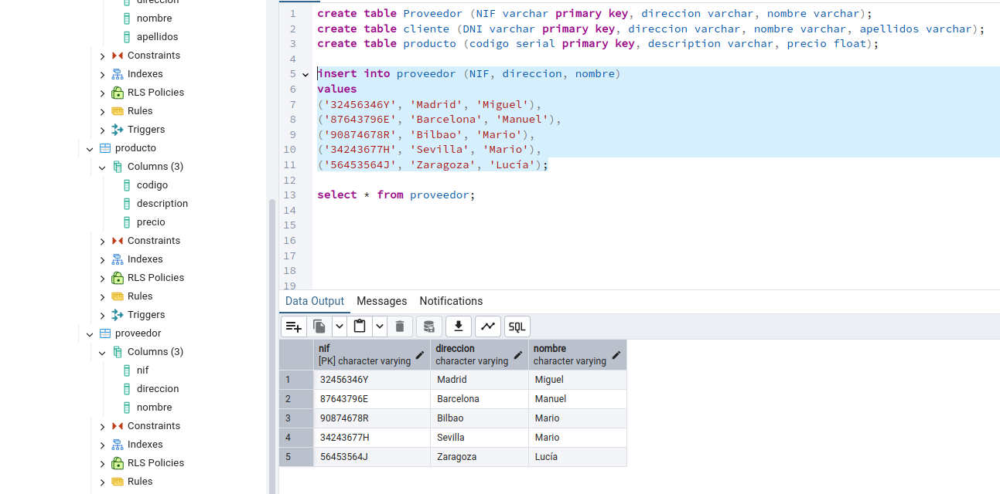

   Repetimos los pasos para las otras dos tablas:

2. **Cliente**:

   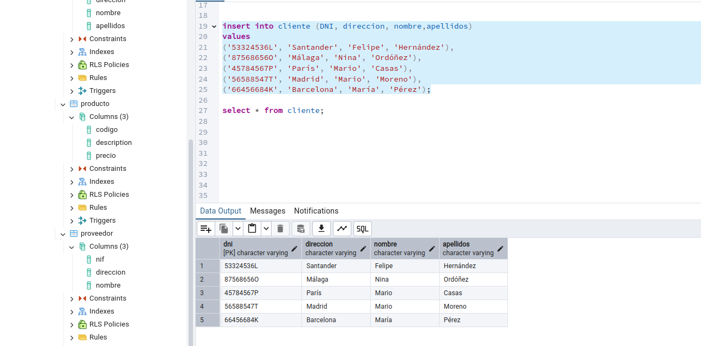

3. **Producto**:

   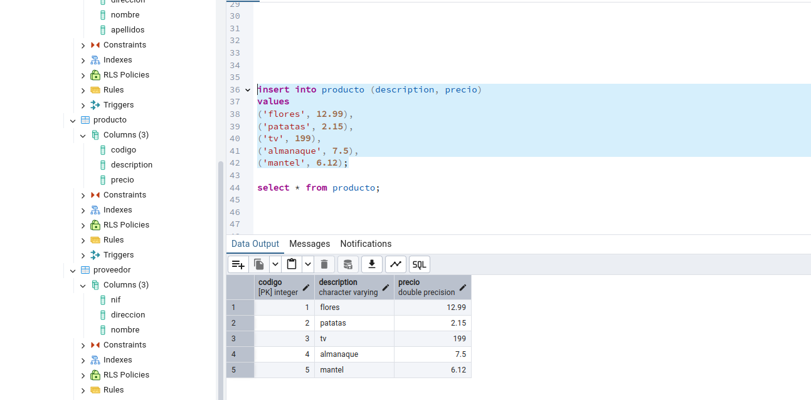

### 3. Realizar las siguientes consultas sql:

1. Obtener el lista de los proveedores que tiene la tienda. Tecleando:

   ```bash
   select * from proveedor;
   ```
  
   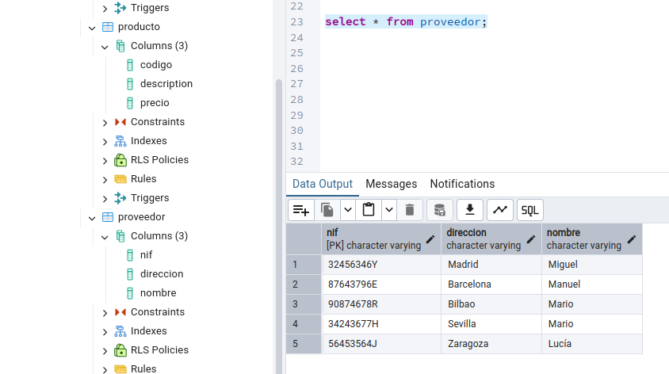

2. Consultar si existe algún cliente que se llame Mario.

   ```bash
   select * from cliente where nombre like 'Mario';
   ```
  
   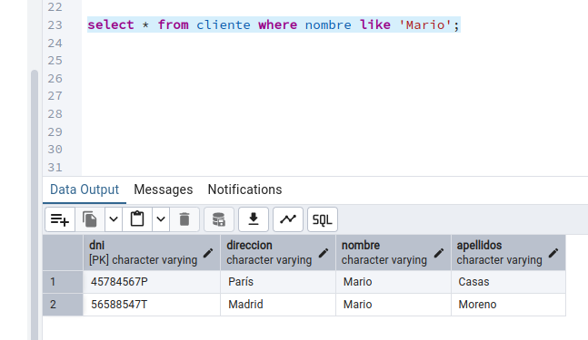

3. Obtener el listado de los productos de la tienda ordenados por precio (ascendente por defecto):

   ```bash
   select * from producto order by precio;
   ```

   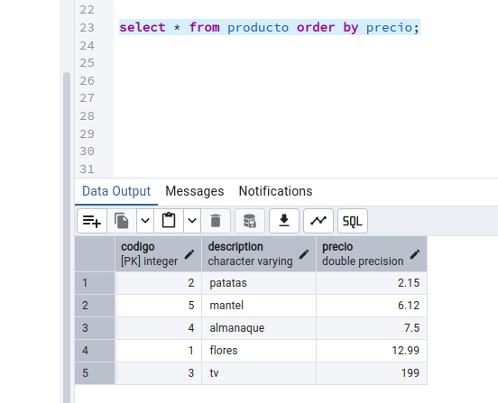

   Si lo quieres descendente:

   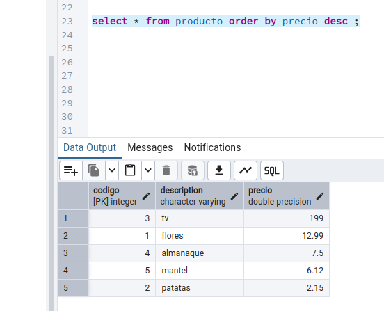

### 4. otros:

- En la tabla producto le he metido el campo description en ingĺes:

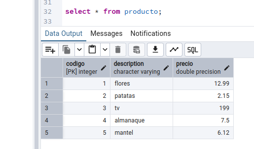

Y me gustaría que esté en castellano:

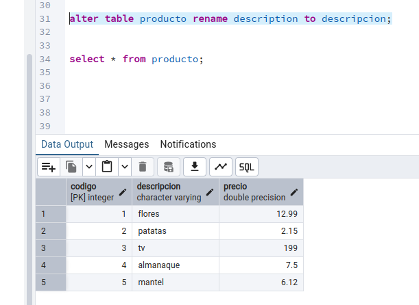
