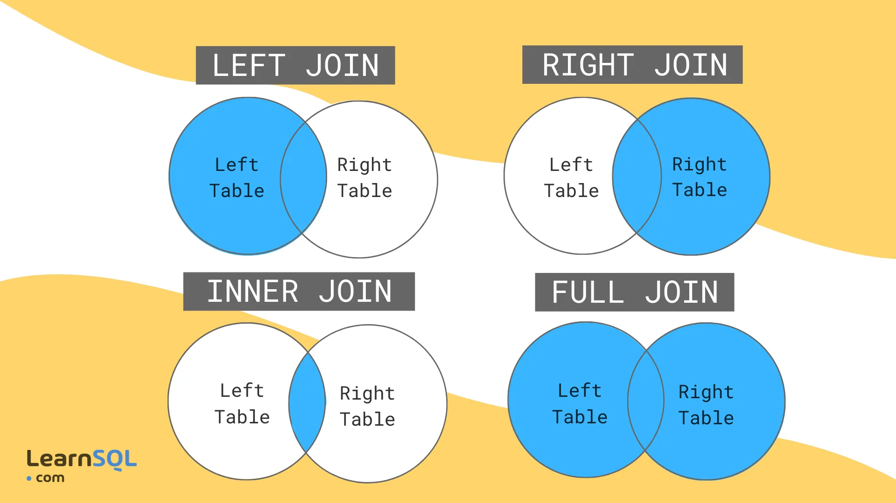

# Restricciones PostgreSQL

Las restricciones sirven para garantizar la exactitud de los datos.

| Constraint  | Descripción                                              |
| ----------- | -------------------------------------------------------- |
| DEFAULT     | Valor por defecto al insertar un registro                |
| NOT NULL    | El campo no puede tener el valor NULL                    |
| UNIQUE      | Dos registros no pueden tener el mismo valor en un campo |
| CHECK       | Se especifican los valores que acepta un campo           |
| PRIMARY KEY | Identifica de forma única cada registro                  |
| FOREIGN KEY | Campo que relaciona dos tablas                           |

## Unión entre tablas

La instrucción de JOIN se usa para enlazar los datos de dos tablas relacionadas a través de algún campo en común (“foreign key”) y así dar como resultado filas que mezclan datos provenientes de las dos (o más) tablas.

| Tipo | Descripción | |
| -----| ----------- |-|
| INNER JOIN | Devuelve sólo los registros que coinciden con la condición de unión en ambas tablas | `SELECT * from TablaA A INNER JOIN TablaB B on A.Key = B.Key;` |
| LEFT JOIN | Devuelve todas las filas de la tabla izquierda, incluso si no se han encontrado filas coincidentes en la tabla derecha. Si no hay coincidencias en la tabla derecha, la consulta devolverá valores NULL para esas columnas | `SELECT * from TablaA A LEFT JOIN TablaB B on A.Key = B.Key;` |
| RIGHT JOIN | Devuelve todas las filas de la tabla derecha. Si no hay coincidencias en la tabla izquierda, se devuelven valores NULL para esas columnas | `SELECT * from TablaA A RIGHT JOIN TablaB B on A.Key = B.Key;` |
| FULL OUTER JOIN  | Devuelve todas las filas de ambas tablas | `SELECT * from TablaA A FULL OUTER JOIN TablaB B on A.Key = B.Key;` |
