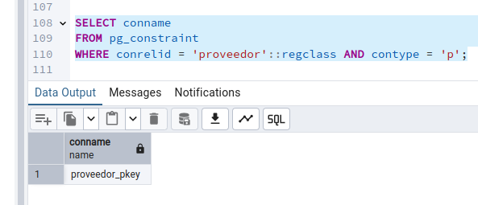
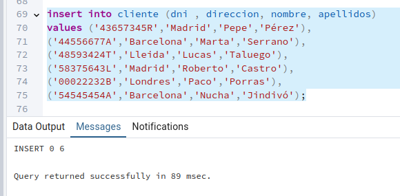

<!-- 
* Curso: Albañiles digitales.
* Asignatura: Database clase 3.
* Nombre del proyecto: "Ejercicio para evaluar clase 3".
* Autor: Koldo Sanmartín.
* Fecha creación: Miércoles 18/12/2024. 
-->

# Ejercicio clase 3 para evaluar.

## Constrains (restricciones) y tablas relacionales.

### Introducción.

El modelo relacional consiste en trasladar a tablas el modelo entidad-relación donde almacenar la información. Cada entidad tendrá su tabla, la cual tendrá sus columnas (atributos) y sus filas (registros).

### Ejercicio.

- Basándonos en el modelo de entidad-relación definido en la Clase 1 y Clase 2, realizar las siguientes acciones:

1. Borrar los registro de las tablas creados en el ejercicio de la Clase 2.

2. Modificar las tablas para añadir las PrimaryKey.

3. Modificar/crear tabla si es necesario para definir la relación entre producto-proveedor (1:N), definiendo las ForeingKey correspondientes.

4. Modificar/crear tabla para definir la relación entre producto-cliente(N:M), definiendo las ForeingKey correspondientes.

5. (OPCIONAL) Os animo que insertéis de nuevo registros en las tablas y hagáis alguna consulta con JOINs para que practiquéis(encantada de revisar todo lo que me mandéis y ayudaros en lo que haga falta).

Para realizar el ejercicio se puede utilizar PGAdmin o directamente los comandos en consola, pero para poder corregirlo necesito un documento en el que me paséis las consultas sql utilizadas en cada caso (al usar pgadmin directamente las sentencias sql os aparecerán en la pestaña SQL al guardar los cambios de cada una de las tablas).

### Resolución:

Basándonos en el esquema relacional del ejercicio:

#### 1. Borrar los registro de las tablas creados en el ejercicio de la Clase 2.

Veamos como tenemos las tablas actualmente, empezamos por proveedor:

Ahora haber que hay en tabla producto:

Finalmente la tabla cliente:

Borremos registros. Para eso usamos el comando truncate, que borra todos los registros existentes en una tabla. Vamos por orden, empecemos por tabla proveedor:

Comprobamos que se han borrado efectivamente:

Ahora lo mismo para la tabla producto:

Comprobamos:

Finalmente con la tabla cliente:

Comprobación de que se han eliminados los registros:

#### 2. Modificar las tablas para añadir las PrimaryKey.

Yo ya les había puesto primary key a todas, pero se la quiteré a una y se la volveré a colocar. Hay que consultar cómo se llama la primary key de la tabla a sql:

Ahora la borro:

Compruebo que se haya borrado:

Vemos que no aparace PK debajo de la columna nif (que era la primary key), y ahora se la vuelvo a colocar:

Solo resta comprobar que se ha añadido:

Haría así con las otras tablas, pero como se ve que puedo lograrlo con las otras tablas, no voy a hacerlo por repetitivo.

#### 3. Modificar/crear tabla si es necesario para definir la relación entre producto-proveedor (1:N), definiendo las ForeingKey correspondientes.

Aquí sabemos que cada producto sólo puede tener un único proveedor, y que un proveedor puede tener uno o mas productos. Mi lógica me dice que debería crear una columna en la tabla producto que tenga una foreign key que lleve de manera unívoca a la primary key de la tabla proveedor, convirtiendo la tabla producto en tabla hija de la tabla padre proveedor.

Para ello voy a crear la columna nif_proveedor en la tabla producto:

Comprobamos que existe:

Una vez creado, convertimos este campo en foreing key:

Así es como se crea foreing key. En este caso añadí la cláusula `on update cascade` para prevenir que si el nif cambia en la tabla proveedor, los valores correspondientes en la tabla producto se actualicen automáticamente. Comprobemos que se ha actualizado la tabla producto con el foreing key:

Como se ve en la query tool no aparece si es o no foreing key, así que comprobamos en las propiedades de la propia columna nif_proveedor de la tabla producto:

Ahí nos lo indica. Ahora tenemos relacionadas las dos tablas preveniendo errores, pues si el nif de proveedor no existe, no podremos agregar ningún registro a la tabla producto.

#### 4. Modificar/crear tabla para definir la relación entre producto-cliente(N:M), definiendo las ForeingKey correspondientes.

Aquí como es una relación N:M es obligatorio crear una tabla intermedia que relacione ambas tablas.

La llamaré pedido y estará compuesta de 3 columnas: una primary key que la calificará univocamente llamada id_pedido autoincremental, otra que la relacione con la tabla producto que lleve una foreing key que la relacione con la primary key de la tabla de producto (llamada codigo), y le pondré de nombre cod_producto, y finalmente le agrego otra columna para relacionarla con la tabla cliente y su primary key (que es dni), el nombre de esta columna será dni_cliente, siendo foreing key de la columna dni de la tabla cliente. El nuevo esquema relacional se vería así:

Creemos ahora la tabla:

Comprobamos que esté hecha, y habríamos terminado:

#### 5. (OPCIONAL) Os animo que insertéis de nuevo registros en las tablas y hagáis alguna consulta con JOINs para que practiquéis(encantada de revisar todo lo que me mandéis y ayudaros en lo que haga falta).

Empecemos con ingresando valores en la tabla cliente:

La comprobamos:

Ahora en la tabla proveedor:

Comprobamos:

Ahora en la tabla producto, teniendo cuidado en la columna nif_proveedor, que debe coincidir con la columna nif de la tabla proveedor, y la columna codigo es autoincremental, con lo que no haría falta rellenarla:

Comprobamos (vemos que los códigos del 1 al 5 no aparecen, pues son los que eliminé al principio del ejercicio):

Ahora en la tabla recién creada pedido teniendo cuidado en las columnas cod_producto y dni_cliente, que son foreing keys, que deberían coincidir cod_producto con la columna codigo de la tabla producto y dni_cliente con la columna dni de la tabla cliente, y la columna id_pedido es autoincremental, con lo que no haría falta rellenarla:

Comprobamos (vemos que los códigos del 1 al 5 no aparecen, pues son los que eliminé al principio del ejercicio):

Alguna prueba:

