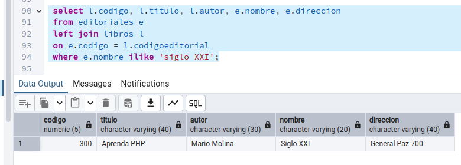

<!-- 
* Curso: Albañiles digitales.
* Asignatura: Database clase 3.
* Nombre del proyecto: "Ejercicios hechos en clase 3".
* Autor: Koldo Sanmartín.
* Fecha creación: Miércoles 18/12/2024. 
-->

# Ejercicios hechos en clase.

## Ejercicio 1.

- Tablas y registros dados para trabajar en el ejercicio 1:

```sql
create table libros(
  codigo numeric(5),
  titulo varchar(40),
  autor varchar(30),
  codigoeditorial numeric(3)
 );
create table editoriales(
  codigo numeric(3),
  nombre varchar(20),
  direccion varchar(40),
  primary key (codigo)
);
insert into editoriales values (1, 'Planeta', 'Colon 120');
insert into editoriales values (2, 'Emece', 'Estrada 356');
insert into editoriales values (3 ,'Siglo XXI', 'General Paz 700');
insert into libros values (100, 'El aleph', 'Borges', 1);
insert into libros values (200, 'Martin Fierro', 'Jose Hernandez', 2);
insert into libros values (300, 'Aprenda PHP', 'Mario Molina', 3);
insert into libros values (400, 'Java en 10 minutos', null, 5);
insert into libros values (500, 'Matematica estas ahi', 'Paenza', null);
```

### 1. Una librería almacena la información de sus libros para la venta en dos tablas, `libros` y `editoriales`.

#### 1. Realizamos un `JOIN` para obtener datos de ambas tablas (`titulo`, `autor` y `nombre de la editorial`).

- <mark> Resolución: </mark>

Aquí tenemos en común dos columnas, cada una en una tabla, que nos van a ayudar a hacer join (inner en este caso, pues buscamos los registros comunes en ambas tablas). Las columnas son codigo, en la tabla editoriales, y codigoeditorial, en la tabla libros, las que queremos que coincidan, así:


Al revisar lo que hay en cada tabla, aquí vemos la tabla editoriales:


Aquí lo que contiene la tabla libros:


Podemos observar que salen todas las coincidencias que buscamos entre la columna codigo de la tabla editoriales y la columna codigoeditorial de la tabla libros.

- Si lo que pide el enunciado son los registros totales de ambas tablas, haríamos un full outer join, y vemos los que coinciden y los que no en las columnas especificadas, o sea, todos los registros existentes en ambas tablas, de esta manera:


#### 2. Mostramos el `código del libro`, `título`, `autor`, `nombre de la editorial` y su `dirección` realizando un `JOIN` y empleando `ALIAS`.

- <mark> Resolución: </mark>

Los alias usados aquí son l para la tabla libros y e para la tabla editoriales. Hacemos un inner join con las columnas codigo de la tabla editoriales y codigoeditorial de la tabla libros para encontrar las coincidencias de ambas:


Ésto si queremos ver las coincidencias, pero si quisiésemos ver todas las columnas existentes en ambas tablas independientemente de si coinciden las columnas especificadas, haremos un full outer join (como no se especifica en el enunciado del ejercicio si queremos los totales de los registros de ambas tablas o las coincidencias, pongo las dos formas de hacerlo). Aquí vemos los registros totales de ambas tablas:


#### 3. Realizamos la misma consulta anterior agregando un `WHERE` para obtener solamente los libros de la `editorial "Siglo XXI"`.

- <mark> Resolución: </mark>

Necesitamos las columnas coincidentes en las dos tablas donde la editorial sea "Siglo XXI". hacemos un inner join:


Si quisiéramos buscar los registros totales, independientemente de si las columnas codigo de la tabla editoriales y codigoeditorial de la tabla libros que coincidan con la columna nombre de la tabla editoriales, como esta columna sólo existe en esta tabla, bastaría hacer un left join, pues queremos todos los que haya en la tabla editoriales que especifiqué como ruta de búsqueda (en la cláusula `"from editoriales e"`) colocándola como tabla izquierda, de este modo:



!!! warning Atención:
    Por cierto, indiqué en la clase 3 presencial que `like` no diferencia entre mayúsculas y minúsculas, lo que me obcecaba, creyendo que así era, pero **Chat GPT** me sacó de la duda:
    ```markdown
    **Motivo del problema:**
    La razón por la que `LIKE` no funciona como esperabas es que compara
    cada carácter tal cual aparece, distinguiendo entre letras mayúsculas
    y minúsculas. Si el nombre en la base de datos es, por ejemplo,
    siglo xxi o SIGLO XXI, la cláusula LIKE 'Siglo XXI'
    no encontrará coincidencias.
    **Recomendación:**
    La solución más común y sencilla en PostgreSQL es utilizar
    `ILIKE` cuando deseas realizar búsquedas insensibles
    a mayúsculas y minúsculas.
    ```
    Razón por la cual `like` no me funcionaba como yo esperaba y uso `ilike` en lugar de `like`. También acepta `%` antes y después de los caracteres buscados, para encontrar todas las posibles coincidencias.

#### 4. Obtenemos `título`, `autor` y `nombre de la editorial`, esta vez `ordenados por título`.

- <mark> Resolución: </mark>

Hacemos un inner join si queremos que las columnas `on e.codigo = l.codigoeditorial` coincidan y agregamos `order by l.titulo`, que por defecto los ordena de forma ascendente:


Si quisiéramos ordenar de forma descendente, añadimos `desc` al final de `order by l.titulo`:


Haríamos igualmente un `left join` si quisiéramos ver todos los autores existentes, con independencia de que coincidan en ambas tablas, `order by l.titulo` para ver los autores ordenados de forma ascendente y `order by l.titulo desc` si queremos ordenarlos de forma descendente:


## Ejercicio 2.

- Tablas y registros dados para trabajar en el ejercicio 2:

```sql
create table libro(
 codigo SERIAL,
 titulo varchar(40) not null,
 autor varchar(20) default 'Desconocido',
 primary key (codigo)
);

create table socio(
 documento char(8) not null,
 nombre varchar(30),
 domicilio varchar(30),
 primary key (documento)
);

create table prestamo(
 documento char(8) not null,
 codigolibro int,
 fechaprestamo date not null,
 fechadevolucion date,
 primary key (codigolibro, fechaprestamo)
);

insert into libro (titulo, autor) values ('Manual de 2º grado','Molina Manuel');
insert into libro (titulo, autor) values ('Aprenda PHP', 'Oscar Mendez');
insert into libro (titulo, autor) values ('Martin Fierro', 'Jose Hernandez');

insert into socio values ('22333444', 'Juan Perez', 'Colon 345');
insert into socio values ('23333444', 'Luis Lopez', 'Caseros 940');
insert into socio values ('25333444', 'Ana Herrero', 'Sucre 120');

insert into prestamo values ('22333444', 1, '2016-08-10', '2016-08-12');
insert into prestamo values('22333444',1,'2016-08-15',null);
insert into prestamo values('25333444',2,'2016-08-10','2016-08-13');
insert into prestamo values('25333444',3,'2016-08-10',null);
insert into prestamo values('25333444',3,'2016-08-15',null);
insert into prestamo values('30333444',2,'2016-08-02','2016-08-05');
```

### 2. Una biblioteca registra la información de sus libros en una tabla llamada `libro`, los datos de sus socios en `socio` y los préstamos en una tabla `prestamo`. En la tabla `prestamo` se hace `referencia al libro y al socio` que lo solicita colocando un código que los identifique.

- Lo que nos indica el enunciado es que hay una relación N:M entre las tablas libro y socio (un libro puede ser prestado a múltiples socios, aunque no al mismo tiempo, y a un socio se le puede prestar uno o múltiples libros al mismo tiempo).

- Para relacionarlos, se crea una tercera tabla, prestamo, en la que un libro puede aparecer varias veces en prestamo, con diferentes socios y un socio puede aparecer varias veces en prestamo, con diferentes libros.

#### 1. Consulta para obtener los `préstamos` donde se vea la `fecha del préstamo`, el `nombre del libro` y el `nombre del socio`. Debe devolver `SOLO coincidencias`.

Para aclararnos, veamos los contenidos de las tres tablas, empezando por libro:


Ahora el contenido de la tabla socio:


Finalmente, la tabla préstamo:


- Observándolas con atención, podemos ver que esta última tabla de prestamo es distinta de las otras dos, pues tiene dos primary key's: las columnas codigolibro y fechaprestamo. Esto, en sql, indica que ambas columnas juntas deben tener un código distintivo en cada registro. En este ejercicio esto es adecuado, ya que un mismo libro no puede tener dos fechas iguales de préstamo, evitándonos posibles errores. Aquí también he aprendido que una tabla puede tener mas de un primary key, pues yo creía que sólo puede tener una sola.


Aunque viendo esto me doy cuenta de que sólo puede tener un primary key, pues las columnas se concatenan para fabricar la primary key. De esta forma ¿si ponemos primary key a todas las columnas, toda la tabla sería primary key?

**GPT** dice:

```markdown
Sí, técnicamente si defines todas las columnas de una tabla como parte
de la clave primaria, la combinación de todas esas columnas juntas
formará la clave primaria. Esto implica que cada fila de la tabla
debe ser única considerando la combinación de valores en todas
las columnas.

Recomendación:
Usa claves primarias que sean lo más simples posible, idealmente
una sola columna o una combinación mínima de columnas que garantice
unicidad. Si todas las columnas necesitan ser únicas, puede ser
más adecuado reconsiderar el diseño del modelo de datos.
```

¡¡¡ Aquí cada día aprendo algo nuevo !!!

- <mark> Resolución: </mark>

Se piden solo coincidencias, así que hacemos inner join desde la tabla prestamo hacia las otras dos tablas, por separado con las columnas que las unen: en la tabla libro la columna codigo es común a la columna codigolibro de la tabla prestamo, en la tabla socio es común la columna documento con la columna del mismo nombre de la tabla prestamo. Al mismo tiempo uso alias para las tres tablas, que coinciden con su inicial. Aquí se puede ver:


#### 2. Consulta para obtener los `préstamos` donde se vea la `fecha del préstamo`, el `nombre del libro` y el `nombre del socio`. Debe devolver `TODOS los registros` de préstamos.

- <mark> Resolución: </mark>

En el enunciado se piden todos los registros que haya en la tabla prestamo, como la puse como condición de búsqueda primaria (en la sentencia `from prestamo p`) frente a las otras dos tablas, toma el valor left, así que hacemos left join frente a las otras dos tablas, para que salgan tanto las coincidencias como si no las hay de la tabla prestamo.
Analizando los resultados, vemos que aparecen los 6 registros que tiene la tabla prestamos y se infiere que los 5 primeros resultados tienen coincidencias con las otras dos tablas, mientras que el último coincide con la tabla libro pero no con socio, es por esto que la columna nombre (del socio) aparece como [null]. Así se ve:


