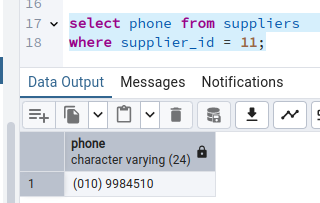
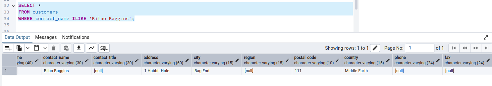
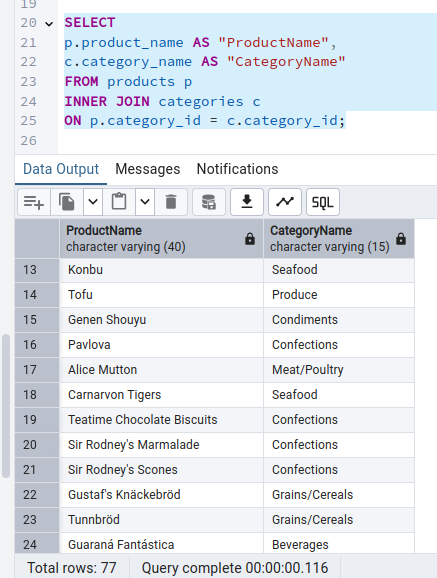
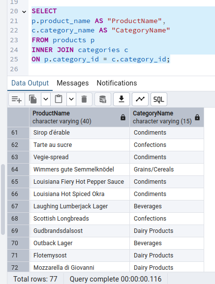
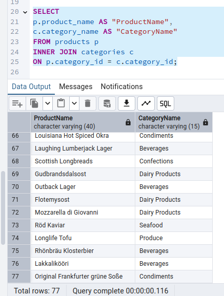

# PROYECTO MÓDULO DATABASES.

## INICIO.

El proyecto final del módulo tiene como objetivo demostrar todos los conocimientos adquiridos durante las
clases. Estará compuesto por tres partes:

## 1. Cuestionario (10%) [Ir](#1-cuestionario-4-preguntas)

## 2. Consultas sobre base de datos (30%). [Ir](#2-consultas-sql-sobre-una-base-de-datos)

## 3. Modelado de una base de datos (60%). [Ir](#3-modelado-base-de-datos)  

---

### 1. CUESTIONARIO (4 preguntas).

---

[Volver a inicio](#inicio)

#### 1. Explicar la diferencia entre `Base de datos Relacional` y `SQL`.

La diferencia principal entre una **Base de Datos Relacional** y **SQL** radica en qué representan y cómo se relacionan entre sí:

1. **Base de Datos Relacional**:

   - Definición: Una base de datos relacional es un **sistema para almacenar datos organizados** en tablas (o relaciones), donde cada tabla tiene columnas (atributos) y filas (registros).

   - Características principales: Los datos están estructurados en tablas con relaciones definidas mediante claves primarias y foráneas.

   - Usa conceptos como entidades, relaciones, y normalización para evitar redundancia.

   - Ejemplos de bases de datos relacionales:

         PostgreSQL.
         MySQL.
         Oracle Database.
         SQL Server.

   - Modelo: Se basa en un modelo matemático conocido como el modelo relacional, donde los datos se representan en tablas interconectadas.

2. **SQL** (Structured Query Language):

- Definición: SQL es un **lenguaje utilizado para interactuar con bases de datos relacionales**.

- Funciones principales: Definir la estructura de la base de datos (crear tablas, índices, etc.) con comandos DDL (Data Definition Language):

```sql
CREATE TABLE customers (
    id SERIAL PRIMARY KEY,
    name VARCHAR(50)
);
```

- Manipular los datos (insertar, actualizar, eliminar, consultar) con comandos DML (Data Manipulation Language):

```sql
SELECT * FROM customers;
INSERT INTO customers (name) VALUES ('John Doe');
```

- Controlar accesos y transacciones con comandos DCL (Data Control Language) y TCL (Transaction Control Language):

```sql
GRANT SELECT ON customers TO user1;
COMMIT;
```

- Ejemplos de operaciones con SQL:

Crear relaciones entre tablas:

```sql
ALTER TABLE orders 
ADD FOREIGN KEY (customer_id) 
REFERENCES customers (id);
```

Consultar datos con filtros y funciones avanzadas:

```sql
SELECT name, COUNT(*) 
FROM customers 
JOIN orders ON customers.id = orders.customer_id 
GROUP BY name;
```

- Relación entre ambas:

1- SQL es el lenguaje usado para trabajar con bases de datos relacionales.

2- No todas las bases de datos usan SQL, pero casi todas las bases de datos relacionales sí lo hacen.

3- Una base de datos relacional (como MySQL o PostgreSQL) provee el entorno para almacenar y organizar los datos, mientras que SQL es la herramienta para gestionar esos datos.

- Resumen de las diferencias:

| Aspecto | Base de Datos Relacional | SQL  |
|---------|--------------------------|------|
|Qué es | Un sistema de almacenamiento de datos | Un lenguaje para interactuar con bases de datos |
| Rol | Define cómo se estructuran y relacionan los datos | Permite definir, manipular y consultar datos |
| Ejemplos | PostgreSQL, MySQL, Oracle Database | SELECT, INSERT, UPDATE, DELETE |
| Dependencia | No depende de SQL (pero SQL es común) | Necesita una base de datos para funcionar |

---

[Volver a inicio](#inicio)

#### 2. ¿Por qué es necesario para la tablas definir una primary key?

Definir una primary key en una tabla es fundamental porque garantiza la integridad y organización de los datos en una base de datos relacional. A continuación, veamos las razones clave:

1. Identificación única de los registros:

   - Una primary key asegura que cada fila de la tabla sea única.

   - Sin una clave primaria, no habría manera confiable de diferenciar registros si tienen valores similares o duplicados en otras columnas.

2. Relaciones entre tablas:

   - La primary key permite crear relaciones entre tablas mediante claves foráneas (foreign keys).

   - Esto es esencial para establecer vínculos entre datos en diferentes tablas y mantener la coherencia.

3. Evitar duplicados:

   - Una primary key garantiza que no se puedan insertar filas duplicadas en la tabla.

   - La base de datos aplica automáticamente una restricción de unicidad sobre la columna definida como primary key.

4. Optimización de búsquedas:

   - Las claves primarias se usan para construir índices en la base de datos, lo que acelera las búsquedas y consultas. Esto mejora el rendimiento al acceder a registros específicos.

5. Integridad referencial:

   - Una primary key ayuda a garantizar que los datos relacionados en otras tablas sean válidos. Por ejemplo, al tener una clave primaria en la tabla customers, puedes asegurar que cualquier customer_id en la tabla orders exista en customers.

6. Base para buenas prácticas en modelado:

   - El uso de primary keys forma parte de las buenas prácticas en diseño de bases de datos.
   - Es un componente central de la normalización, que reduce redundancia y previene inconsistencias en los datos.

---

[Volver a inicio](#inicio)

#### 3. ¿Cómo se denomina la relación que se hace entre una columna de una tabla y la primary key de otra tabla?

La relación que se establece entre una columna de una tabla y la primary key de otra tabla se denomina **clave foránea** (foreign key).

Una clave foránea es una columna (o conjunto de columnas) en una tabla que se utiliza para referenciar la primary key de otra tabla.

Sirve para establecer una relación entre las dos tablas y garantizar la integridad referencial en una base de datos relacional.

- Ventajas de las Claves Foráneas:

1. Garantizan la integridad referencial:

   Aseguran que los datos relacionados estén siempre sincronizados.

   Evitan datos huérfanos (referencias a registros inexistentes).

2. Establecen relaciones claras entre tablas:

   Ayudan a modelar correctamente las relaciones del mundo real (por ejemplo, "un cliente puede tener muchos pedidos").

3. Facilitan las consultas relacionadas:

   Por ejemplo, puedes usar una consulta JOIN para recuperar los pedidos de un cliente específico.

- Tipos de Relaciones Comunes con Claves Foráneas

1. Uno a muchos (1:N):

   Ejemplo: Un cliente puede tener varios pedidos.
   Implementado con una clave primaria en customers y una clave foránea en orders.

2. Muchos a muchos (N:M):

   Ejemplo: Un pedido puede incluir varios productos, y un producto puede aparecer en varios pedidos.
   Implementado mediante una tabla intermedia (por ejemplo, order_details) que contiene claves foráneas a ambas tablas.

3. Uno a uno (1:1):

   Ejemplo: Una tabla de empleados y una tabla de detalles personales.
   Ambas tablas comparten la misma clave primaria, que se usa como clave foránea en una de ellas.

---

[Volver a inicio](#inicio)

#### 4. ¿Qué es lo que necesitamos hacer para poder tener una relación n:m entre dos tablas?

Para implementar una relación muchos a muchos (N:M) entre dos tablas en una base de datos relacional, es necesario crear una **tabla intermedia** (también llamada tabla de unión o tabla puente). Esta tabla intermedia almacena las claves foráneas que conectan las dos tablas principales y permite modelar la relación N:M.

- Pasos para Implementar una Relación N:M :

1. Identificar las tablas principales:

   Las tablas que tendrán la relación muchos a muchos.

   Por ejemplo, estudiantes y cursos.

2. Crear una tabla intermedia:

   Esta tabla tendrá al menos dos columnas, cada una representando una clave foránea que referencia a la clave primaria de las tablas principales.

   Puede incluir columnas adicionales si necesitas almacenar información sobre la relación.

3. Definir claves primarias y foráneas:

   La tabla intermedia, generalmente, tiene una clave primaria compuesta formada por las claves foráneas de las tablas principales, aunque es mejor que tenga una columna con identificador único y otras columnas aparte con claves foráneas que enlacen con las claves primarias de las otras tablas.

---

### 2. CONSULTAS SQL SOBRE UNA BASE DE DATOS.

[Volver a inicio](#inicio)

Vamos a partir de una base de datos ya definida y poblada con datos: <https://github.com/pthom/northwind_psql>

En este repositorio podéis ver el modelo entidad-relación y, en el fichero con extensión sql, todas las consultas necesarias para que os podáis construir una copia de esta base de datos.

Lo primero es tener operativa esta base de datos, para ello podemos hacerlo de dos formas:

- Método 1:

1. Crear una base de datos nueva que se llame ProyectoFinal.

2. Copiar todas las sentencias definidas en el fichero sql y ejecutarlas.

3. Aseguraros que no os da ningún error y que se han creado las tablas con registros.

- Método 2:

1. Crear una base de datos nueva que se llame ProyectoFinal.

2. Descargamos el fichero northwind.sql en nuestro ordenador.

3. Copiamos el chero dentro del docker de postgres para luego poder usar el fichero sql dentro.

4. Entramos dentro del docker de postgres y ejecutamos el fichero sql para que cargue todo en la base de datos.


---

Una vez tengáis la base de datos disponible, hay que realizar las siguientes (9) consultas:

---

[Volver a inicio](#inicio)

#### 1. Buscar todos los clientes (customers) con el código postal 1010.


---

[Volver a inicio](#inicio)

#### 2. Buscar el número de teléfono que tiene el proveedor (supplier) con id 11.



---

[Volver a inicio](#inicio)

#### 3. Listar los primeros 10 pedidos (orders) ordenados de manera descendente por la fecha de pedido.


---

[Volver a inicio](#inicio)

#### 4. Buscar todos los clientes (customers) que vivan en London, Madrid o Brazil.

Aquí hago dos capturas de pantalla, pues la tabla tiene muchas columnas y no se aprecian todos los resultados en una captura única.


---

[Volver a inicio](#inicio)

#### 5. Añadir un nuevo registro en la tabla clientes (customers) con la siguiente información (indicada en el mismo orden de las columnas): “XYZ”, “The Shire”, “Bilbo Baggins”, “1 Hobbit-Hole", "Bag End", "111" y "Middle Earth".

Esta tabla tiene 11 columnas y das 7 datos. La voy a entender así para realizar el ejercicio:

- customer_id: "XYZ".
- company_name: "The Shire".
- contact_name : "Bilbo Baggins".
- contact_tittle: -
- address: "1 Hobbit-Hole".
- city: "Bag end".
- region: -
- postal_code: "111".
- country: "Middle Earth".
- phone: -
- fax: -

(Aunque no sé si acierto con la historia del señor de los anillos, quizá la ciudad debería ser "The Shire", o quizá la región, pues shire es la comarca o región o distrito y "Bag end" no sé ni a qué se refiere, haber si soy fiel la historia original).


Comprobamos que hemos ingresado el registro correctamente (dos capturas de pantalla, pues la tabla tiene muchas columnas y no caben en una):




---

[Volver a inicio](#inicio)

#### 6. Actualizar el código postal a “11122” del cliente “Bilbo Baggins”.


Lo comprobamos:


---

[Volver a inicio](#inicio)

#### 7. Mostrar “ProductName” y “CategoryName” de todos los productos (products).

En la tabla products tenemos product_name y en la tabla categories está category_name, y tienen en común category_id, así que hacemos un inner join y hay 77 registros, que no caben en una captura de pantalla, así que muestro todos en varias capturas:









---

[Volver a inicio](#inicio)

#### 8. Mostrar “OrderID” y “CompanyName” del expedidor (shippers) de todos los pedidos (orders) realizados antes del 9 de agosto de 2012.

Muestro "OrderID" de la tabla orders, columna order_id y "CompanyName" de la tabla shippers, columna company_name, haciendo un inner join de ambas con las columnas comunes ship_via de la tabla orders y shipper_id de la tabla shippers con la fecha pedida, y ordenados por "OrderID", pero hay 830 y tendría que hacer 1,000.000 de pantallazos, así que muestro 7 para ver algunos, pero todos pienso que serían demasiados y para el ejercicio con mostrar algunos al azar, creo que bastaría.


---

[Volver a inicio](#inicio)

#### 9. Mostar el número de pedidos (orders) realizados por cada expedidor (shipper).


---

<mark> Entregar todas las consultas sql realizadas y los resultados de ellas para poder validar que están correctas. </mark>

---

[Volver a inicio](#inicio)

### 3. MODELADO BASE DE DATOS.

Siguiendo los pasos que hemos ido haciendo en los ejercicios de clase:

- Plantear un caso de uso (el que vosotros queráis o podemos realizarlo sobre proyectos entregados en otros módulos) en el que quede bien explicado los requisitos y el caso de uso que queremos implementar en nuestra base de datos. Mínimo debe tener 3 entidades con 3-4 atributos cada una de ellas; también deben existir relaciones 1:N y N:M.

- Crear el modelo entidad-relación correspondiente.

- Crear la base de datos con sus tablas y relaciones entre ellas.

- Poblar la base de datos con una serie de registros y hacer al menos 5 consultas para demostrar que vuestro modelo cumple con los requisitos indicados en el paso 1.

<mark> Entregar todas las consultas sql realizadas y los resultados de ellas para poder validar que están correctas junto con el diagrama ER. </mark>

---

Antes de comenzar diré que hay un archivo que adjunto llamado:

> poblar_tablas.sql

en el que, si lo copias y pegas en pgadmin, ya te proporciono la creación de las tablas y las pueblo con 25 registros en cada tabla, caso de que lo quisieses probar.

#### RESOLUCION:

Planteamiento para la cooperativa agrícola "Prados Verdes", dedicada a la venta de productos agrícolas, que cumpla con los requisitos:

- Cada cliente puede comprar múltiples productos, pero cada producto solo puede ser comprado por un cliente.

- Cada proveedor puede proveer múltiples productos, y cada producto puede ser proveído por un único proveedor, como unidad, aunque varios proveedores pueden proveer el mismo producto.

- Registrar los datos de los clientes, incluyendo su identificación y datos personales.

- Registrar los datos de los proveedores, incluyendo su identificación y datos empresariales.

- Registrar los productos disponibles, con su información básica y precio de venta y de suministro.

- Registrar las compras realizadas por los clientes, indicando la cantidad y el total por cada producto.

- Registrar los suministros realizados por los proveedores, indicando la cantidad y el total por cada producto.

Requisitos:

Clientes y productos están relacionados mediante una tabla intermedia que representa las compras.

Proveedores y productos están relacionados mediante una tabla intermedia que representa lo que se provee.

- Estas son las tablas propuestas:

-- Creación de la tabla clientes:

```sql
CREATE TABLE clientes (
    cliente_id SERIAL PRIMARY KEY,
    DNI VARCHAR(10) NOT NULL UNIQUE,
    nombre VARCHAR(15) NOT NULL,
    apellido1 VARCHAR(15),
    apellido2 VARCHAR(15),
    direccion VARCHAR(100),
    ciudad VARCHAR(15),
    telefono VARCHAR(15),
    fecha_alta DATE NOT NULL DEFAULT CURRENT_DATE
);
```

-- Tabla Proveedores:

```sql
CREATE TABLE Proveedores (
    proveedor_id SERIAL PRIMARY KEY,
    NIF VARCHAR(10) NOT NULL UNIQUE,
    empresa VARCHAR(50) NOT NULL,
    direccion VARCHAR(100),
    ciudad VARCHAR(15),
    telefono VARCHAR(15),
    fecha_alta DATE NOT NULL DEFAULT CURRENT_DATE
);
```

-- Creación de la tabla productos:

```sql
CREATE TABLE productos (
    producto_id SERIAL PRIMARY KEY,
    denominación VARCHAR(30) NOT NULL,
    pvp DECIMAL(10, 2) NOT NULL,
    precio_proveedor DECIMAL(10, 2) NOT NULL,
    cantidad_disponible INTEGER NOT NULL,
    unidad_medida VARCHAR(20) NOT NULL,
    fecha_actualización TIMESTAMP DEFAULT CURRENT_TIMESTAMP
);
```

-- Creación de la tabla intermedia compras (clientes y productos):

```sql
CREATE TABLE compras (
    compra_id SERIAL PRIMARY KEY,
    cliente_id INTEGER REFERENCES clientes(cliente_id) ON DELETE CASCADE,
    producto_id INTEGER REFERENCES productos(producto_id) ON DELETE CASCADE,
    cantidad INTEGER NOT NULL,
    total DECIMAL(10, 2) NOT NULL,
    fecha_compra TIMESTAMP NOT NULL DEFAULT CURRENT_TIMESTAMP
);
```

-- Tabla intermedia suministro_proveedores (Productos y Proveedores):

```sql
CREATE TABLE suministro_proveedores (
    sumunistro_id SERIAL PRIMARY KEY,
    producto_id INT REFERENCES Productos(producto_id) ON DELETE CASCADE,
    proveedor_id INT REFERENCES Proveedores(proveedor_id) ON DELETE CASCADE,
    cantidad INTEGER NOT NULL,
    total DECIMAL(10, 2) NOT NULL,
    fecha_suministro TIMESTAMP NOT NULL DEFAULT CURRENT_TIMESTAMP
);
```

Así quedaría el esquema entidad-relación del proyecto:


Consultas SQL para validar el modelo:

- Obtener todos los productos comprados por un cliente:

```sql
   SELECT p.denominación, c.cantidad, p.unidad_medida, c.total
   FROM compras c
   JOIN productos p ON c.producto_id = p.producto_id
   WHERE c.cliente_id = 1;
```


- Obtener todos los proveedores que suministran un producto específico:

```sql
   SELECT pr.empresa, pr.direccion, pr.ciudad sp.fecha_suministro
   FROM suministro_proveedores sp
   JOIN proveedores pr ON sp.proveedor_id = pr.proveedor_id
   WHERE sp.producto_id = 2;
```


- Obtener todos los productos disponibles en la tienda:

```sql
   SELECT denominación, pvp, cantidad_disponible, unidad_medida
   FROM productos;
```


- Obtener la cantidad total de productos comprados por todos los clientes en orden alfabético:

```sql
   SELECT 
       p.denominación, 
       SUM(c.cantidad) AS total_comprado, 
       p.unidad_medida
   FROM compras c
   JOIN productos p ON c.producto_id = p.producto_id
   GROUP BY p.denominación, p.unidad_medida
   ORDER BY p.denominación ASC;
```


- Obtener todos los clientes que han comprado un producto específico, ordenados por primer apellido:

```sql
   SELECT cl.nombre, cl.apellido1, cl.apellido2
   FROM compras c
   JOIN clientes cl ON c.cliente_id = cl.cliente_id
   WHERE c.producto_id = 1
   ORDER BY cl.apellido1;
```


- Consultar los productos comprados por un cliente específico, mostrando también la cantidad comprada y el total de la compra:

```sql
   SELECT p.denominación, c.cantidad, p.unidad_medida ,c.total, c.fecha_compra
   FROM compras c
   JOIN productos p ON c.producto_id = p.producto_id
   WHERE c.cliente_id = 1;
```


- Consultar los productos suministrados por un proveedor específico, junto con la cantidad y el total del suministro:

```sql
   SELECT p.denominación, s.cantidad, p.unidad_medida, s.total, s.fecha_suministro
   FROM suministro_proveedores s
   JOIN productos p ON s.producto_id = p.producto_id
   WHERE s.proveedor_id = 1;
```


- Consultar la cantidad disponible de un producto:

```sql
   SELECT p.denominación, p.cantidad_disponible, p.unidad_medida
   FROM productos p
   WHERE p.producto_id = 1;
```


- Consultar el total gastado por un cliente en todas sus compras:

```sql
   SELECT c.cliente_id, SUM(c.total) AS total_gastado
   FROM compras c
   WHERE c.cliente_id = 1
   GROUP BY c.cliente_id;
```


- Consultar los proveedores que suministran un producto específico, junto con la cantidad suministrada y el total del suministro:

```sql
   SELECT p.empresa, sp.cantidad, pr.unidad_medida, sp.total, sp.fecha_suministro
   FROM suministro_proveedores sp
   JOIN proveedores p ON sp.proveedor_id = p.proveedor_id
   JOIN productos pr ON sp.producto_id = pr.producto_id
   WHERE sp.producto_id = 1;
```


- Relaciones:

1:N entre clientes y compras (un cliente puede hacer varias compras, pero cada compra es de un solo cliente).
1:N entre productos y compras (un producto puede ser comprado por varios clientes, pero cada compra es de un solo producto).
1:N entre productos y suministro_proveedores(un producto puede ser suministrado por varios proveedores, pero cada vez se provee un solo producto).
1:N entre proveedores y suministro_proveedores (un proveedor puede suministrar múltiples productos).
N:M entre productos y clientes (un producto puede ser comprado por varios clientes y un cliente puede comprar múltiples productos).
N:M entre productos y proveedores (un producto puede ser suministrado por varios proveedores y un proveedor puede suministrar múltiples productos).
